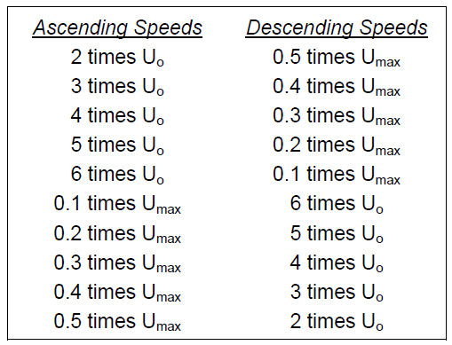

# Manual de calibração do sistema eletrônico

## 1. Importância da calibração

Segundo o VIM (vocabulário internacional de metrologia), Elemento dum sistema de medição que é diretamente afetado por um fenômeno, corpo ou substância que contém a grandeza a ser medida. Ou seja, sensores são dispositivos responsáveis pela comunicação entre as grandezas a serem medidas e o resto do sistema de medição e por converter essas grandezas físicas em valores que possam ser medidos e analisados. Assim sendo, sensores também necessitam ser estruturas físicas, produzidos com componentes reais e sujeitos a degradação e alteração de constantes e valores, o que torna necessário o uso de técnicas de calibração e manutenção preventiva ou corretiva para evitar maiores danos ao serviço prestado, à precisão dos resultados entregues e até mesmo ao tempo de vida útil do equipamento.

A definição de calibração, de acordo com a WMO, é um conjunto de operações que estabelece, sob dadas condições, a relação entre os valores das quantidades indicados pelos instrumentos ou sistemas de medição, ou valores representados pelos materiais medidos ou matérias de referencia e seus valores correspondentes realizados pelos padrões. Dito isto, é perceptível que a calibração de equipamentos e sensores é um passo essencial para garantir a confiabilidade dos valores adquiridos em sistemas de medição, sejam eles de temperatura, umidade, pressão, pH, peso ou qualquer outra medida.

Desta forma, o objetivo deste manual é de expor os procedimentos de calibração para os sensores utilizados no sistema de monitoramento de viticultura, com todas as informações necessárias para que os subsistemas mantenham a sua confiabilidade, precisão e acurácia de dados. Não necessariamente o próprio agricultor/manutentor deverá realizar a calibração, pois poderá utilizar de laboratórios especializados em calibração. Para a realização certificada destes processos de calibração, estes laboratórios precisam possuir o certificado da RBC, órgão do Inmetro responsável pela certificação de laboratórios de calibração, demonstrando que os mesmos seguem a normativa ABNT NBR ISO/IEC 17025:2017. Os mesmos podem ser encontrados a partir do site da RBC.

A frequência de calibração do sensor, inicialmente, deve ser determinada através das especificações fornecidas pelo fabricante (deriva, repetitividade, linearidade, incerteza, etc.) e da precisão requerida na aplicação.  Observando a ILAC—G24 OIML D 10, são cinco os métodos de revisão do intervalo de medição, sendo eles: ajuste automático, gráfico de controle, por tempo de uso, testagem com “caixa-preta” e outras aproximações estatísticas. Destas aproximações estatísticas tem-se como comuns quatro variedades: Ajuste do intervalo por deriva, Ajuste com base nas três últimas calibrações – ponderado, Método de Schumacher e Método de Poisson. Para este manual, estaremos o Método Schumacher, visto que sua facilidade de aplicação e credibilidade facilitará a realização correta do processo pelo manutentor do sistema.

Neste método, a cada ciclo de calibração, o sensor pode ser classificado como:

- **A (Avariado):** designa problema que possa prejudicar um ou mais parâmetros do instrumento;
- **C (Conforme):** designa conformidade comprovada durante a revalidação;
- **F (Fora de tolerância):** o instrumento funciona bem, mas fora da tolerância especificada (não conforme).

Desta forma, uma sequência de três a quatro calibrações é suficiente para determinar se é necessário aumentar, manter ou diminuir a frequência de calibração, a partir do estado em que o sensor é classificado no momento da calibração, que pode ser visualizado na tabela abaixo.

| Condição anterior: | A | F | C |
|:-:|:-:|:-:|:-:|
| CCC | P | D | E |
| FCC | P | D | P |
| ACC | P | D | E |
| CF | M | M | P |
| CA | M | M | P |
| FC | P | M | P |
| FF | M | M | P |
| FA | M | M | P |
| AC | P | D | P |
| AF | M | M | P |
| AA | M | M | P |
 
As decisões são descritas como:

- **D:** indica diminuir a periodicidade em 20\%;
- **E:** indica aumentar a periodicidade em 10\%;
- **M:** indica reduzir a periodicidade em  35\%;
- **P:** indica um caso duvidoso, e o período não deve ser alterado.

Como exemplo, temos os seguintes dados (em semanas) na tabela abaixo.

| Período | D | E | P | M |
|:-:|:-:|:-:|:-:|:-:|
| 5 | 4 | 7 | 5 | * |
| 6 | 5 | 8 | 6 | 5 |
| 8 | 7 | 10 | 8 | 5 |
| 10 | 9 | 13 | 10 | 6 |
 
Em anexo segue uma planilha de controle, com o método Schumacher implementado, cuja implementação foi inspirada na planilha disponibilizada pela empresa MetroEX, estará disponível em anexo a este documento.

## 2. Sensor de velocidade do vento

As normativas responsáveis de calibração dos anemômetros de copo e de hélice para aplicações meteorológicas são as ASTM D 5092-02 e ISO 17713-1, enquanto a IEC 61400-12-01 international standard, Wind energy generation systems – Power performance measurements of electricity producing wind turbines, Annex F é voltada para anemômetros de copo utilizados na produção elétrica. Para anemômetros ultrassônicos são utilizadas das normas ASTM D 6011-96 e ISO 16622 para sua calibração}. 

O processo de calibração é baseado no ASTM D 5092-02, que está presente no anexo para mais detalhes de como realizar o procedimento.

Para a realização da calibração, deve-se utilizar de um túnel de vento com as características mostradas na tabela abaixo, além de manter as condições de temperatura e pressão do ambiente de testes.

| Características do túnel de vento | Requerimento mínimo |
|:-:|:-:|
| Bloqueio | A área frontal do anemômetro é inferior a  5% da área da seção transversal da seção de teste |
| Capacidade de velocidade do vento | Deve ser capaz de atingir velocidades de pelo menos  50% da faixa de aplicação e deve manter a velocidade  dentro de +/- 0.2 m/s |
| Uniformidade de fluxo | O perfil de fluxo na seção de teste deve ser  constante dentro de 1% |
| Turbulência | Deve ser inferior a 1% na seção de teste |
| Uniformidade da densidade do ar | O perfil de densidade na seção de teste deve ser  inferior a 3% de diferença |
| Leitura da velocidade do vento | Manter uma precisão relativa de 0.1 m/s para  sua fonte rastreável |

Conforme o ASTM D 5092-02 \cite{astm_5092}, os passos de calibração são:

1. Instalar o anemômetro com um ângulo de ataque de 5°;
2. Adquirir os dados de velocidade do túnel de vento e a taxa de rotação do anemômetro juntamente com as condições ambientais da sessão de teste, por um período de 30 a 100 segundos para cada velocidade, com uma taxa de amostragem de, pelo menos, 100Hz. É necessário garantir que o fluxo do vento esteja estável antes de realizar as medições.
3. A calibração é realizada em uma faixa que inicia em duas vezes o limiar inferior do anemômetro (Uo) até 0.5 vezes o limiar superior de velocidade (Umax), com velocidades incrementais definidos conforme \ref{img:anem_speed}, dando um total de vinte velocidades de teste.
4. Realizar a análise de regressão dos mínimos quadrados utilizando dos dados coletados de velocidade do vento e da rotação de anemômetro para determinar a inclinação e o deslocamento da função de transferência da calibração, gerando a curva de calibração do sensor.
5. Calcular as velocidades residuais do vento a partir da velocidade do vento prevista para as taxas de rotação do anemômetro utilizando a função de transferência determinada e, então, subtrair os valores previstos dos valores medidos.

 
É importante citar que a função de transferência é válida, apenas, para 50% da velocidade máxima, o que observando o sensor escolhido, é mais do que suficiente para o espectro de dados desejado. 

Uma maneira de realizar a calibração é desenvolvendo um sistema caseiro de medição, utilizando de um soprador de ar ou secador de cabelo jogando ar frio diretamente ao copo do anemômetro, conforme figura abaixo, e registrar suas medições para, desta forma, realizar os mesmos passos matemáticos descritos na normativa.  A desvantagem deste método é a falta de controle de diferentes tipos de velocidade, o que reduz a precisão da curva de calibração, além do baixo controle da velocidade da saída do soprador. Entretanto, esta solução ganha pontos em praticidade e custo, visto que uma estação é capaz de calibrar diversos sensores, além de evitar o transporte para a calibração.

 
 O procedimento:
 
 1. Instalar o anemômetro com um ângulo de ataque de 5°;
 2. Adquirir o nível de velocidade do soprador (mínimo/médio/máximo) e a taxa de rotação do anemômetro, por um período de 30 a 100 segundos para cada velocidade.
 3. Realizar a mudança de velocidade de ascendente e decrescente, variando sendo adquirida 2n-1 dados, sendo n o número de velocidades. 
 4. Realizar a análise de regressão dos mínimos quadrados utilizando dos dados coletados de velocidade do vento e da rotação de anemômetro para determinar a inclinação e o deslocamento da função de transferência da calibração, gerando a curva de calibração do sensor.
 5. Calcular as velocidades residuais do vento a partir da velocidade do vento prevista para as taxas de rotação do anemômetro utilizando a função de transferência determinada e, então, subtrair os valores previstos dos valores medidos.
 
 É possível realizar esta calibração, no território nacional, por empresas como a Unimetro, Exatitec e Instemac. Cujo valor orçado na Unimetro, no dia 15/10/2020, ficando em torno de 526 reais. Observando o valor unitário do sensor, que é de 140 reais na mesma data, acaba sendo mais viável a troca do sensor, a manutenção no local ou a calibração no local. Desta forma, a recomendação é de criar o sistema caseiro de calibração e, caso não seja possível, realizar a troca do sensor quando necessário, visto o custo-benefício.

## 3. Sensor de direção do vento

A normativa responsável pelas regras de calibração de Indicadores de direção é a IEC 61400-12-01 (_international standard, Wind energy generation systems – Power performance measurements of electricity producing wind turbines, Annex N_).

Para a calibração seguindo a IEC 61400-12-01, utiliza-se de um túnel de vento, em que o sensor fica alinhado paralelamente ao fluxo de vento. Para a sua calibração um fluxo constante de ar (usualmente 8 m/s) é mantido enquanto o sensor é rotacionado em torno do seu eixo vertical. A rotação é induzida por uma unidade de acionamento e seu ângulo é medido por um encoder rotativo que é conectado por um acoplamento de foles à unidade de acionamento. O eixo de encoder rotativo é concêntrico e coaxial em respeito ao sensor e ao eixo rotativo da unidade de acionamento, o que pode ser observado na imagem abaixo.

O processo de calibração consiste dos seguintes passos:

1. Instalar o sensor alinhado as duas linhas de laser que são permanentemente instaladas no túnel de vento, de maneira com que os feixes se cruzem no ponto central. O sensor deve estar alinhado ao feixe vertical e instalado no cruzamento dos feixes. 
2. Ligar o túnel e aumentar o fluxo de vento, de forma constante, até 8 m/s. A partir deste ponto, o sensor é rotacionado em torno do seu eixo vertical, que pode ser realizado de duas formas: a uma taxa constante de yaw ou passo a passo. O recomendado é utilizar uma taxa constante, visto que passo a passo pode gerar erros de leitura do sensor. Assim, duas voltas completas são executadas, uma no sentido anti-horário e outra no sentido horário. Para evitar o efeito de histerese, as voltas são dadas com uma sobreposição de ângulos de, pelo menos, 20°. Desta forma, temos uma volta no sentido anti-horário de 0 a 380° e uma no sentido horário de 380° a 0°.
3. Avaliar a resposta medida, no caso de um sensor digital, a velocidade de saída e o ângulo de guinada são listados juntamente com os valores de saída do sensor e o desvio calculado a partir do ângulo esperado em relação ao ângulo observado, conforme imagem \ref{img:biruta_calib_out}.

O processo de  calibração local, não exigindo assim a contratação de um serviço especializado que, possui o revéz de apenas regula os valores da saída, sem avaliar o a influência do vento. A descrição do passo a passo é:

1. Ligar a saída do sensor a um microcontrolador com leitura de monitor serial para a visualização de dados.
2. Definir o Norte do sensor como o ponto de maior tensão de saída.
3. Capturar todos os valores de tensão de saída, realizando duas voltas, uma em de sentido anti-horário e horário, para evitar histerese.
4. Definir os valores de tensão de saída para as direções cardeais e colaterais, e seus respectivos ângulos. Determinar os ângulos com auxílio de alguma ferramenta de medição, como um transferidor, um inclinômetro ou um encoder rotativo.

No Brasil, é possível encontrar este serviço sendo realizado por empresa como a Unimetro, cujo valor orçado em 15/10/2020 é de 294 reais. Considerando o valor de aquisição do sensor, orçado em 149 reais na mesma data, para este componente em específico, observando o ponto financeiro especificamente, é mais viável realizar a a troca do sensor, a manutenção no local ou a calibração no local. Desta forma, a indicação é de realizar a calibração no local e, caso não seja possível, adquirir um novo sensor ao invés de mandar para a calibração no laboratório, visto o custo-benefício.

## 4. Sensor pluviométrico

Não foi encontrado nenhuma normativa ISO/IEC/ASTM referente a uma padronização na calibração dos referidos sensores. Entretanto, diversos fabricantes possuem kits de calibração para os seus pluviômetros e, a partir dos manuais de calibração fornecidos por estes fabricantes: Accurate, Nova Linx e All Weather Inc \cite, podemos inferir o seguinte procedimento de calibração:

1. Preparar o sensor para a calibração, abrindo-o e retirando possíveis sujeiras do seu interior que possam estar atrapalhando na medição. Após isso, remontar o sensor.
2. Utilizando uma quantidade pré-determinada de água a uma determinada velocidade de precipitação, simulando uma chuva, contar o número de vezes que o sensor é acionado.
3. Comparar o número de vezes de acionamento real em relação ao esperado. Calcular o erro percentual.
4. Realizar os passos 2 e 3 com diferentes velocidades de precipitação. A partir disto, realizar a regressão em mínimos quadrados para fornecer a curva de calibração do sensor.
5. Apertar ou soltar os parafusos de calibração, a depender do resultado. Apertar serve para aumentar o número de acionamentos, enquanto soltar realiza o oposto. Repetir os passos 2, 3 e 4 para obter uma nova curva de calibração.

Para se calcular a quantidade de chuva por acionamento, dado em centímetro cúbico por acionamento (cc/tip), é necessário conhecer o raio interno do coletor em centímetros ($r$)e a quantidade desejada de chuva por acionamento, também conhecida como resolução do sensor em centímetros ($res$). Desta forma, temos o calculo demonstrado na equação \ref{eq:cc_tip}:

Onde:

 = quantidade de água por acionamento [ml];

 = raio do coletor [cm];

 = quantidade de água por acionamento [cm]. \\

Com isto, podemos determinar a quantidade esperada de acionamento. Para isto, precisamos do cc/tip anteriormente calculado e da quantidade de água a ser utilizada em ml, conforme a equação abaixo:

Onde:

 = quantidade de vezes que há o acionamento do sensor [adimensional];

 = quantidade de água precipitada [ml];

 = quantidade de água por acionamento [ml]. \\

Desta forma, é possível realizar a calibração do sensor. É importante delimitar a quantidade de precipitação de água por hora durante o período de testes, visto que, ao utilizar de um fluxo muito algo, a acurácia do sensor ficará comprometida, já que durante o tempo de acionamento do sensor, a água que passa pelo funil não é contabilizada, senso assim, quanto mais lento o fluxo de água por hora, maior a precisão da calibração do sensor. No manual do All Weather Inc, temos a recomendação de um fluxo de 400 mm/h, enquanto no manual do Nova Linx essa velocidade varia de acordo com o diâmetro do bocal utilizado no equipamento de testes, variando de 79 mm/h até 1187 mm/hora em um pluviômetro de 6” de diâmetro interno. Já no manual do Accurate, a recomendação é utilizar de um "copo plástico com um furo no fundo", o que não é a forma ideal, do ponto de vista técnico.

Empresas como a Unimetro e a Beta-X realizam esta calibração em solo nacional, com o valor orçado pela Unimetro de 574 reais em 21/10/2020. Considerando o valor de aquisição do sensor, orçado em 239 reais na mesma data, para este componente em específico, observando o ponto financeiro especificamente, é mais viável realizar a aquisição de um novo componente ou a calibração pelo próprio técnico.

Para a realização da calibração, sem utilizar de um laboratório, é necessário certificar que a quantidade de água e a velocidade de precipitação sejam controlados. Para isso, pode-se utilizar de uma proveta graduada para inserir a quantidade de líquido desejado e de uma bureta para controlar o fluxo de água desejado. Para determinar a velocidade da precipitação, deverá ser realizado testes com diferentes ângulos de abertura da válvula da bureta com a quantidade máxima de água suportada e cronometrar o tempo levado em segundos para que a bureta fique vazia. Desta forma, é possível calcular a velocidade de precipitação através da equação :

Onde:

 = velocidade de precipitação da água [mm/h];

 = quantidade de água precipitada [mm];

 = tempo levado para acabar a precipitação [hora]. \\

Para a abertura da válvula, é importante que a abertura do ângulo seja a mais precisa possível, utilizando de uma ferramenta de medição de ângulo para determinar o ângulo correto de abertura, como um transferidor, um inclinômetro ou um encoder rotativo. 

## 5. Sensor de temperatura, umidade e pressão atmosférica

A sugestão da fabricante  é utilizar uma API produzida especificamente para o BME280, fortemente recomendada para a realização da compensação de valores na saída do sensor. Essa API pode ser encontrada na Bosch Sensortec, e utilizada para leitura e gerenciamento dos valores recebidos pelo sensor. De acordo com o mesmo documento, deve-se levar em conta também que a leitura dos sensores de temperatura e pressão devem ser feitos considerando 20 bits de dados, enquanto para a leitura da umidade são utilizados apenas 16 bits, ambos sem identificação de sinal (ou unsigned, utilizando a nomenclatura padrão), considerando apenas valores positivos ou nulos (não negativos).

Apesar do uso da API desenvolvida ser extremamente recomendado, a Bosch também disponibiliza um código para leitura e compensação dos dados de saída de cada um dos sensores: temperatura, pressão e umidade. Conforme é deixado claro na documentação, os resultados e consequências gerados pelo uso  do código para tal fim é de responsabilidade do usuário. Desta forma, a calibração deve ser realizada pelo usuário, não sendo necessário levar a um laboratório credenciado, preferencialmente utilizando da API desenvolvida pela Bosch.

Abaixo segue uma descrição sobre boas práticas de calibração para sensores de temperatura, umidade e pressão, seguindo a literatura.

### 5.1 Calibração de sensores de temperatura e umidade

Geralmente os procedimentos para a calibração de sensores de temperatura e de umidade aparecem juntos, devido à grande quantidade de equipamentos de meteorologia e de sensores  que medem temperatura e umidade. Esses equipamentos são chamados termo-higrômetros. 

Em alguns manuais disponibilizados no site do Inmetro, produzidos pela CT-11 (Comissão Técnica de Temperatura e Umidade) e revisados pela Dicla (Divisão de acreditação de laboratórios), são dadas as orientações para a acreditação de laboratórios e para a realização da calibração de sensores de temperatura e umidade. A versão utilizada será mais recente encontrada  (produzida no ano de 2020), garantindo assim a validade e aplicabilidade das informações. Esse documento foi produzido com o intuito de auxiliar no cumprimento dos requisitos para acreditação e, segundo o mesmo, se suas orientações forem seguidas, o laboratório será assegurado de que os requisitos foram cumpridos. Caso contrário, o mesmo deverá buscar formas de constatar a o atendimento de todos os requisitos. A RBC também já disponibiliza em seu site uma lista de laboratórios de calibração acreditados segundo a ABNT NBR ISO/IEC 17025: 2017.

O primeiro requisito para a realização de medições é que todas as medições de temperatura, incluindo as realizadas para determinação da umidade, devem ser rastreáveis à Escala Internacional de Temperatura de 1990 (EIT-90). Com isso, tem-se que para a medição de temperatura, os valores medidos podem ser dados tanto em Kelvin (K) quanto em Celsius (°C).

Quanto ao espaço físico do laboratório, suas condições devem estar dentro dos limites entregues de temperatura (entre 18ºC e 28ºC), de umidade relativa (entre 45% UR e 75% UR), de alimentação elétrica (suprindo as especificações dadas pelo fabricante do equipamento). Recomenda-se também que o laboratório possua aterramento para a utilização dos equipamentos. Em todos os casos, nunca deve-se ultrapassar os limites entregues pela fabricante do dispositivo, sejam eles de temperatura ou umidade. O BME280, sensor utilizado para a obtenção dos valores de temperatura, pressão e umidade, possui limites inferiores e superiores, respectivamente, de -40 °C e 85 °C para a temperatura e entre 0% e 100% de umidade relativa, tornando seu manuseio mais simples e reduzindo os riscos de ultrapassá-los, vistos que são temperaturas relativamente extremas quando comparadas à temperatura ambiente e abrangendo toda a faixa possível de umidade.

Quanto à capacidade de medição e calibração (CMC), que é definida na NIT-Dicla-021 como sendo a “menor incerteza de medição que um laboratório de calibração pode obter quando realiza calibrações ou medições dentro do escopo da sua acreditação”. Essa definição deve expressar, por meio de um único valor, por uma lista de valores, por uma função ou por uma matriz de valores (com mais de um parâmetro) a incerteza do melhor equipamento disponível para realizar a medição dentro do escopo desejado, deixando claras as limitações do laboratório e de seus equipamentos.

Existem também algumas recomendações a serem seguidas pelos laboratórios. Entre elas,  que o laboratório tenha equipamentos que permitam a verificação intermediária da calibração dos padrões de temperatura e de umidade,  que as verificações da situação da calibração feitas pelo próprio laboratório sejam realizadas de acordo com um procedimento documentado e com incerteza estimada e que os instrumentos de medição de umidade (higrômetros) e de umidade e temperatura (termohigrômetros) sejam calibrados empregando câmara climática ou gerador de umidade.

Quanto aos padrões utilizados para a calibração, quando nos referimos a temperatura e umidade, podem ser padrões de referência ou de trabalho. De acordo com o Anexo 1 da TRS957 da WHO (_World Health Organization_), um padrão de referência é um padrão autenticado e uniforme com grau de pureza adequado ao uso pretendido e destinado a testes químicos e físicos específicos, nos quais suas propriedades são comparadas às do produto em análise [9]. O padrão de trabalho deve ser utilizado mais costumeiramente dentro do laboratório para realizar medidas com um maior grau de incerteza, enquanto padrões de referências devem ser de uso pouco frequente e calibrados por um laboratório com uma maior CMC. O padrão de referência pode ser usado para calibrar o padrão de trabalho mesmo tendo a mesma qualidade. Se esse for o caso ou se o laboratório calibrar seu padrão de trabalho com outro laboratório, recomenda-se que o mesmo deixe essa informação e documentada. O intervalo de calibração de padrões, a existência ou não de uma calibração intermediária e o tipo de padrão utilizado nas classificações devem ser todos declarados.

É recomendado que os instrumentos de medição usados em conjunto com os padrões de temperatura e de umidade (potenciômetros, multímetros, pontes ou instrumentos similares) sejam periodicamente verificados no próprio laboratório, através de métodos comparativos ou com instrumentos previamente calibrados. Além disso, para garantir o uso correto de instrumentos fora do laboratório (em campo), é recomendado que hajam ao menos 2 equipamentos: 1 para ser levado a campo e outro para calibrá-lo, que permanecerá dentro do laboratório, como referência. Sensores termopar, termômetro de resistência de platina (TRP), higrômetro do tipo condensação, higrômetro do tipo capacitivo ou indutivo são exemplos de tipo de sensores que são utilizados como padrão de referência.

Um exemplo de calibração de indicadores de temperatura por simulação de sinal pode ser visto no documento Euramet cg 11 Versão 2.0 e um exemplo de calibração de temperatura com blocos  no Euramet cg 13 Versão 2.0.

### 5.2 Calibração de sensores de pressão

O sensor utilizado, BME280, além de realizar a medição de valores de temperatura e umidade, também realiza a medição de pressão atmosférica. Sensores de pressão atmosférica (comumente chamados de barômetros) também necessitam passar por processos de calibração e manutenção periodicamente, garantindo a precisão e qualidade dos dados entregues ao usuário. Assim como os demais processos de calibração, os requisitos necessários para garantir a rastreabilidade do processo de calibração do barômetro utilizado, deve-se seguir as normas da ABNT ISO IEC 17025. No site da RBC podem ser encontrados os laboratórios acreditados para a realização desse serviço.

O aferimento de pressão é sempre realizado a partir de um referencial e a escolha desse referencial define o tipo de pressão com que estamos lidando.  As modalidade de pressão são: pressão absoluta, pressão manométrica, vácuo e pressão diferencial. A pressão absoluta, que é a modalidade que será tratada e utilizada no projeto, é uma pressão acima do zero absoluto, utilizando esse mesmo valor como referência. A pressão relativa (ou manométrica) busca medir a diferença a pressão medida e a pressão absoluta, usando, portanto, esse último como referencial. A pressão negativa (ou vácuo) também utiliza a pressão absoluta como padrão, com a diferença de que, nesse caso, o valor medido será inferior ao valor absoluto, justificando a nomenclatura estabelecida. A última modalidade é a pressão diferencial, que mede a diferença entre duas pressões p1 e p2, contanto que nem p1 e nem p2 sejam a pressão absoluta ou o zero absoluto, o que cairia nas demais modalidades já apresentadas.

A unidade de medida padrão, de acordo com o Sistema Internacional de Medidas (SI), para medição de pressão é o Pascal (Pa), que é definido como Newton por metro quadrado (P = N/m²).  Entretanto, quando se trata de pressão atmosférica, é muito comum utilizar um múltiplo desta grandeza, o hPa (hectopascal, 10² Pa). Como a pressão atmosférica ao nível do mar (1 atm) é dado por 101325 Pa (1013,25 hPa), a representação em hPa acaba sendo mais utilizado, seja pelo tamanho da valor a ser mostrado/armazenado ou por conveniência de representação, tornando essa a unidade de medida mais utilizada no mundo.

Medidores de pressão podem ser classificados em 2 grandes grupos: medidores fundamentais e relativos. Os fundamentais são aqueles que utilizam da própria definição da grandeza, tais como o manômetro de coluna líquida e a balança de pressão, enquanto os relativos fazem uso de outras propriedades físicas ou fenômenos físicos para realizar a medição, tais como manômetros, vacuômetros, manovacuômetros, manômetros digitais de pistão, transdutores/transmissores de pressão, entre outros. No nosso caso, vamos utilizar um medidor relativo que se adequa mais ao grupo de transmissores de pressão, que geralmente é o nome usado para descrever sensores que possuem uma interface elétrica. No manual de referência utilizado, disponibilizado pelo próprio Inmetro, esse tipo de equipamento também é identificado como Instrumento de Medição Mostrador Digital de Pressão. 

“Nestes tipos de medidores a estimulação mecânica de um sensor causada pela pressão é convertida em um sinal elétrico, o qual é apresentado na forma digital. Este sinal é amplificado e indicado na unidade de uma modalidade de pressão ou em uma grandeza elétrica. O princípio elétrico de medição de um instrumento mostrador digital de pressão pode ser geralmente: resistivo, capacitivo, indutivo e piezoelétrico. Dependendo da modalidade de pressão medida o instrumento mostrador digital de pressão pode ser um manômetro digital, um vacuômetro digital ou um manovacuômetro digital. Quando a indicação do dispositivo de medição é na unidade de uma grandeza elétrica o instrumento é um transdutor/ transmissor de pressão”. Tanto transdutores quanto transmissores de pressão geralmente possuem um intervalo de tensão de resposta localizado na faixa de mV, sendo entre 30 mV e 100 mV para transdutores e entre 4 mV a 20 mV para transmissores, variando também de acordo com a tensão de alimentação aplicada. 

Para a calibração de transdutores ou transmissores de pressão, são necessários os seguintes equipamentos:

- Balança de pressão ou quando for o caso um padrão de pressão com características metrológicas adequadas;
- Termômetros;
- Um medidor de umidade relativa do ar;
- Um medidor de pressão atmosférica;
- Um multímetro.

Para o preparo da calibração, é necessário:

- Garantir que o equipamento esteja isento de impurezas (se necessário limpar utilizando uma seringa com álcool isopropílico);
- Determinar o número de pontos de calibração;
- Selecionar o padrão utilizado (deve ter incerteza de medição pelo menos 4 vezes menor que o próprio instrumento) e
- Posicionar o equipamento conforme sua posição normal de trabalho.  

A calibração deve ser realizada em um ambiente com temperatura entre 1ºC e 28ºC, utilizando um medidor mostrador digital padrão de pressão ou uma balança de pressão como referência.
    
Após o procedimento adotado, que depende de como a empresa fará a calibração e do tipo de equipamento a ser calibrado, deve-se avaliar a qualidade da calibração observando se todos os erros pontuais do instrumento calibrado estão contidos no intervalo da sua resolução.

## 6. Sensor de umidade do solo

Para a acurácia do modelo de aferição, faz-se necessário ajustar os valores máximos e mínimos de umidade em função do solo (esse valor pode variar de acordo com as características de solo). 

Para o valor mínimo de umidade: deixa-se a ponta do sensor exposta no ar, o valor analógico lido pelo microcontrolador será a atribuição mínima, ou seja: umidade = 0\%; 

Para o valor máximo de umidade: submerge-se a ponta do sensor em um copo com água, o valor analógico lido pelo microcontrolador será a atribuição máxima, ou seja: umidade = 100\%; 

De modo a garantir a sua precisão, é necessário que a sensibilidade do módulo seja ajustada no potenciômetro indicado, e o procedimento de medição para valores mínimos e máximos sejam repetidos até que seu erro de medição esteja menor ou igual a 5\%. Garantindo assim que o equipamento esteja preciso e que os valores medidos sejam exatos. Para o cálculo do percentual do erro, utiliza-se a seguinte expressão:  

}\cdot%20100)

Onde:

 =  valor máximo de umidade esperado;

 = valor mínimo de umidade esperado;  

 = valor medido;

O produto possui garantia de 3 meses, no entanto a vida útil do sensor vai ser determinada a partir das condições do meio de medição. Recomenda-se fazer o procedimento do roteiro de calibração a cada 3 meses e em caso de erros contínuos acima de 5\%, a troca da ponteira de medição se faz necessária. 

## 7. Sensor de temperatura e ph do solo

Para o eletrodo de pH de Solo e o módulo PH4508C, o roteiro de calibração é descrito da seguinte forma: 

1. Conecta-se o eletrodo de pH ao módulo PH4508C. Em seguida submerge-se o eletrodo em substância preparada com solução de pH conhecido adquirindo junto do eletrodo ou separadamente em fornecedores especializados. 
2. Repete-se o procedimento utilizando solução de caráter ácido, básico e neutro, observando o valor medido com o esperado. 
3. Caso o valor encontrado tenha uma variação igual ou menor a 5\%, o seu sensor (módulo e eletrodo) está considerado calibrado e pronto pra uso. 

Recomenda-se realizar o procedimento a cada 3 meses, como caráter de manutenção. Quaisquer variâncias fora da margem esperada, acionar equipe técnica para troca do sensor. 