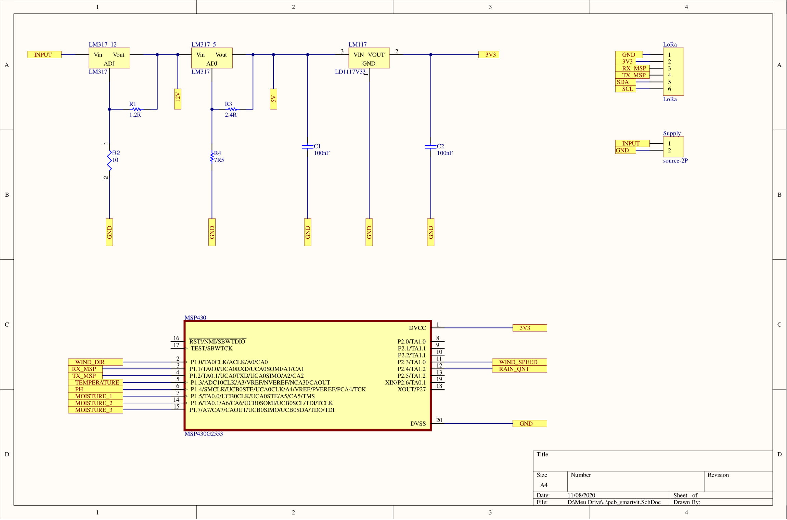
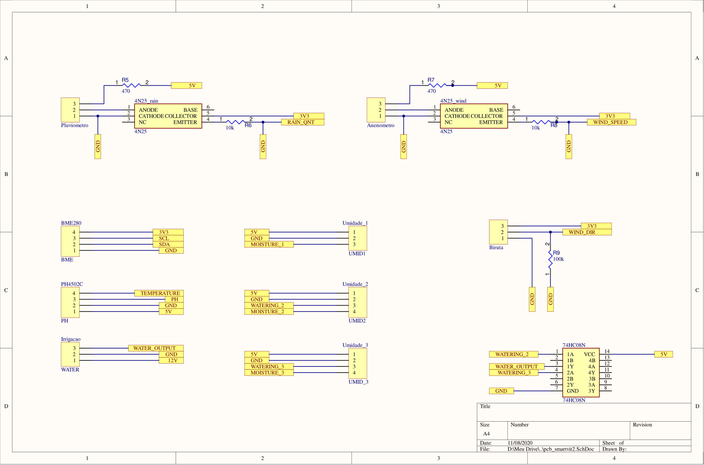
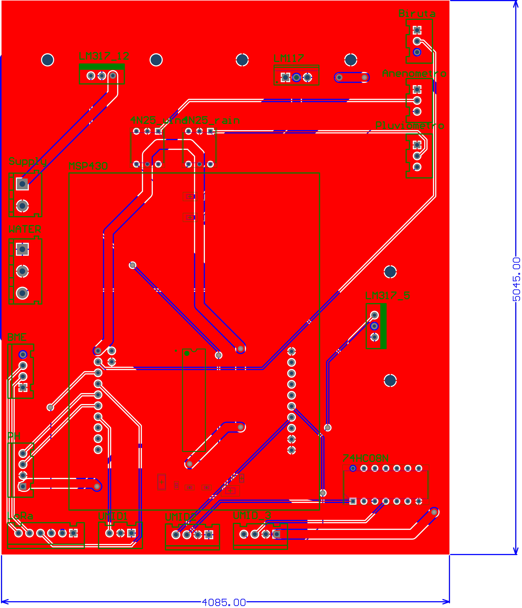
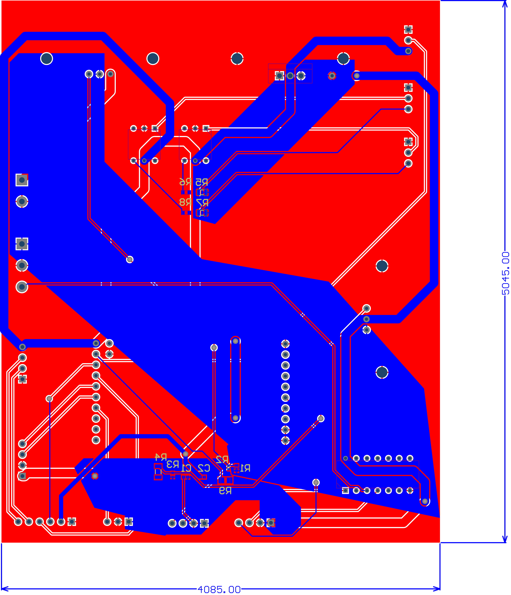
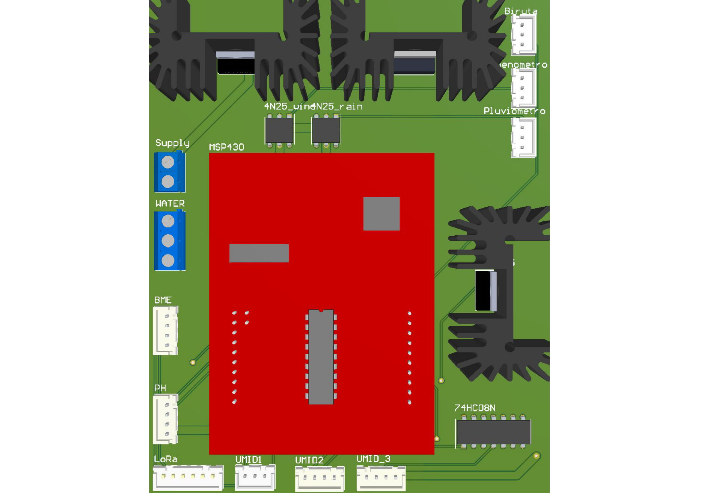
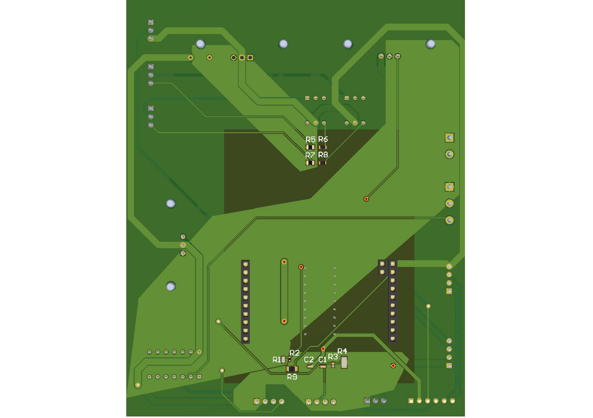

# Placa de circuito impresso

O objetivo da placa de circuito impresso é de ser uma plataforma que englobe todos os circuitos, evitando assim que seja necessário fios desnecessários de conexão. Desta forma,esta placa foi realizada de acordo com os diagramas esquemáticos presente abaixo:

O layout foi realizado utilizando o Software comercial Altium Designer (versão 20.1.11). O esquemático abrange todas as conexões entre componentes, CIs e microcontroladores do sistema, removendo a necessidade de grande número de conexões entre eles de forma direta e mapeando o acesso a cada um desses sensores e microcontroladores. 

Dentro da PCB estarão presentes componentes, tais como resistores, capacitores e CIs utilizados para as mais diversas funções: regulação de tensão, proteção de carga, limitador de corrente, tratamento do sinal e redução de ruídos. Além disso, a MSP430 também foi anexada à placa, permitindo que suas conexões sejam feitas por trilhas ao invés de mais fios tradicionais. 

Os conectores utilizados foram todos do tipo Molex, que são conectores mais firmes e resistentes quando comparados a _jumpers_ e entregando mais liberdade, com possibilidade de desconexão, quando necessário, se compararmos com a utilização de soldas para este fim. Com isso, a equipe terá maior liberdade para atuar em casos de necessidade de alterações em estruturas, movimentação, manutenção, troca de sensores e verificação de funcionamento sem muitas modificações e com redução de chances de erro durante o processo de conexão e desconexão dos fios.

Também foi adicionado à PCB espaço adicional para a inserção de dissipadores de calor em cada um dos reguladores de tensão utilizados, visto serem componentes que chegam a temperaturas relativamente altas, podendo gerar danos ao circuito e aos próprios componentes.
| Descrição | Informação |
|:-:|:-:|
| Dimensões | 4085.00x5045.00 |
| Tipo de face | Face dupla (_Bottom layer_ e _Top Layer_) |
| Material | FR-4 |
| Espessura (mm) | 1.6 |

O projeto de todo o esquemático e layout da pcb, além da definição de parâmetros e materiais foi realizado pela equipe de eletrônica. A fabricação da PCB será encomendada, para que a mesma seja produzida nos mesmos padrões de qualidade de seu desenvolvimento. 

Aproveitando do uso de duas faces da placa, foram utilizados 3 planos para o desenvolvimento das trilhas do sistema. Um plano, que cobre toda a _top layer_, foi utilizado em conexão com o GND (ponto de referência do sistema). Já a _bottom layer_ foi utilizada para construir dois planos: um plano conectado aos 12V e outro plano conectado aos 5V. Isso foi realizado para evitar problemas com trilhas finas em casos de alta potência, visto que estes são os canais de alimentação do sistema, e para a simplificação do projeto e da geração das demais trilhas, reduzindo significativamente seu número.

O desenvolvimento do esquemático, do desenho 3D e 2D da MSP430 também foi trabalho da equipe de eletrônica, visto que poucos materiais confiáveis e compatíveis com a placa real fora encontrados na internet. Esse projeto foi realizado utilizando todas as medidas da placa física, mais especificamente a MSP430G2ET.

Também foi tomado o cuidado de gerar um pcb com todos os componentes possuindo suas representações 3D disponíveis em suas bibliotecas, gerando uma melhor visualização e previsão do produto a ser gerado e do resultado final do projeto.

As Figuras abaixo são, respectivamente, as representações da _top layer_ e da _bottom layer_ da placa gerada. 

As figuras abaixo são, respectivamente, uma representação _top view_  _bottom view_ da PCB3D.

