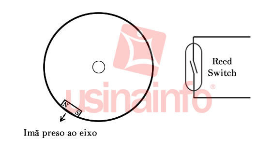
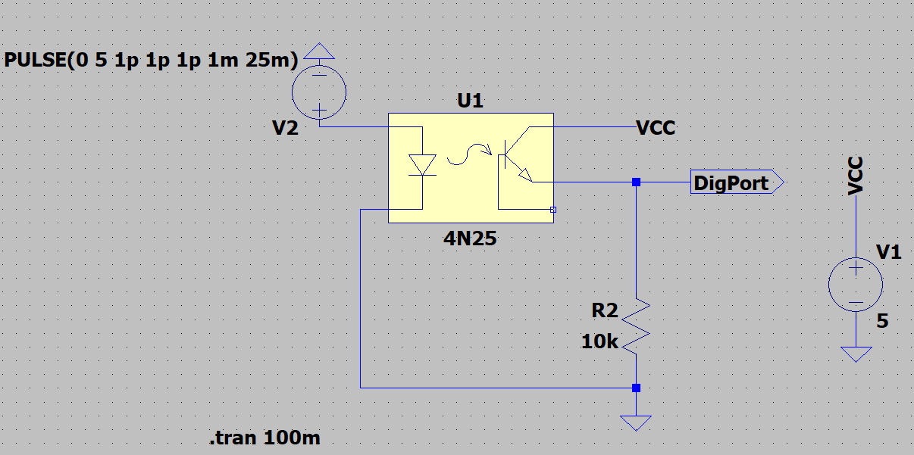
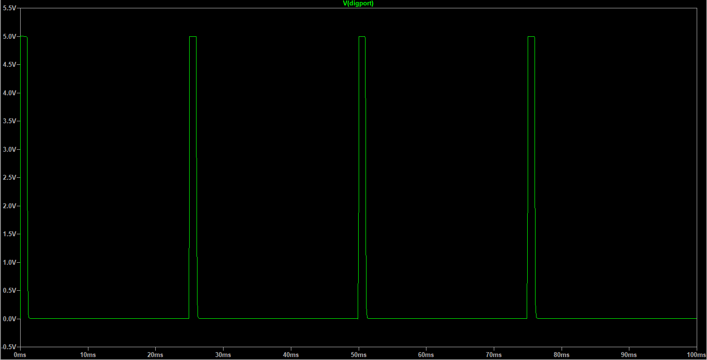

## Anemômetro

## 1. Definição do modelo

A justificativa de escolha dos sensores e módulos de medição foi realizada levando-se em consideração os requisitos de alto nível, buscando atender as necessidades levantadas no escopo, cumprir os requisitos de baixo nível, reduzir redundâncias desnecessárias, mitigar e previnir os riscos associados, considerando-se modelos que forneçam dados seguros, confiáveis, que possam ser calibrados e que atenda às expectativas dos nossos envolvidos estando aliados à qualidade do projeto.

De acordo com o Manual de Produção de Uvas Viniferas de Alta Qualidade, o vento possui direta influência sobre a qualidade das uvas, visto que interfere diretamente na eficiência do controle químico e de pragas, além de não poderem ser fortes, principalmente no estágio de desbrota. Desta forma, como requisito do anemômetro, temos que a velocidade a ser atendida deve atender até o que é considerado, pela escala Beaufort, como um desastre natural, sendo acima de 63 nós (32,5 m/s ou 118 km/h). Outro ponto vital considerado foi a disponibilidade em mercado nacional da peça, visto o tempo limitado de desenvolvimento do sistema e o escopo de protótipo, além, claramente, do custo-benefício do mesmo. Em uma situação de desenvolvimento comercial, este sensor pode ser revisto, visto que pedidos em larga escala da China passam a ser vantajosas, principalmente do ponto de visto financeiro.

Dito isto, temos o anemômetro digital para arduino ou raspberry, desenvolvido nacionalmente pela WRFCOMERCIAL, como opção escolhida. Feito de um material leve e resistente a corrosão, o alumínio, é capaz de suportar velocidades de 130 km/h e tem uma sensibilidade de aquisição de dados de 0,25 m/s. Desta forma, ele é capaz de atender ao requisito de dados, além de possuir disponibilidade nacional e ser o mais viável economicamente dizendo, tornando-se assim, a escolha óbvia para este ponto do projeto.

<figure>
  
  <figcaption>
      Equação 1
  </figcaption>
</figure>

 
 

## 2. Especificações técnicas

|Característica|Dado|
|-|-|
|Modelo|SV10|
|Tensão de trabalho|5 Vcc|
|Tipo de dado|Digital|
|Medição méxima|33,3 m/s|
|Meio de transmissão|Cabo|
|Comprimento do cabo|10m|
|Temperatura de Trabalho|-40ºC ~ 80ºC|
|Sensibilidade|0,25 m/s|
|Material|Alumínio|

Dados quanto a precisão do sensor não foram informados pelo fabricante, entretanto, é possível deduzir este erro a partir da análise da construção do sensor. Sabendo que o sensor é do tipo digital, cujo funcionamento ocorre partir do acionamento de um reed switch a cada volta, o erro associado a este sistema é o de uma volta, isto é, aproximadamente uma vez o perímetro da circunferência realizada pelo anemômetro. Desta forma, temos o erro de medição associado ao sensor de $\pm 0,9236 \: m/s$, bem condizente com as outras opções observadas no mercado, visto que o erro é associado a construção e a forma de aquisição de dados do sensor.

## 3. Detalhamento técnico e cálculos

O anemômetro escolhido possui seu funcionamento através do acionamento de uma chave magnética no seu interior a cada volta completado. Desta forma, na sua estrutura interna, há um imã preso ao eixo que, ao passar perto de um reed switch, faz com que os seus contatos internos fechem, permitindo a passagem da corrente.

Desta forma, o formato de saída dos dados é através de pulsos digitais, um pulso por rotação. Desta maneira, seu comportamento foi simulado, com o intuito de visualizar como fica a saída de dados, como demonstrado na Figura \ref{img:anem_sim_out}:

Com isso em mente, temos que calcular a velocidade do vento de saída do sistema. Para isto, estimando que uma volta dada pelo anemômetro corresponde ao perímetro de um círculo perfeito (uma volta completa) com um dado raio correspondente as hastes do anemômetro. Observando o número de voltas realizadas em um determinado período de tempo, temos a seguinte equação:

Onde:

  = velocidade do vento [m/s];

 = raio [m];

 = numéro de voltas [adimensional] ;

 = período [segundos];

Que, em conformidade com a normativa internacional da WMO, temos o sua saída de dados dada na unidade do SI, que é em metros por segundo (m/s).Para este sensor, é importante lembrar que o período de aquisição de dados na MSP430 é de 1 minuto. Desta forma, o período de coleta deve ser adequado para a unidade no SI de cada sensor,  sendo dividido para chegar em segundos no caso do anemômetro.

Como circuito foi utilizado do optoacoplador 4N25 como estágio de condicionamento de sinal, realizando a função de isolamento elétrico. Como a tensão de alimentação do sensor é maior do que a do microcontrolador, este isolamento proporciona uma segurança à porta de entrada do sensor, visto que possíveis picos de tensão poderiam queimar a porta da MSP. Além disso, o sinal vindo direto da alimentação está menos suscetível a rúido e perdas do que o sinal vindo do sensor, devido ao menor comprimento dos cabos.

## Referências

UVIBRA. Manual de Produção de Uvas Viniferas de Alta Qualidade. Bento Gonçalves - RS, Ago. 2015.

National Meteorological Library Archive. National Meteorological Library and Archive Fact sheet 6 — The Beaufort Scale. Disponível em: <https://www.metoffice.gov.uk/binaries/content/assets/metofficegovuk/pdf/research/library-and-archive/library/publications/factsheets/factsheet_6-the-beaufort-scale.pdf>.
