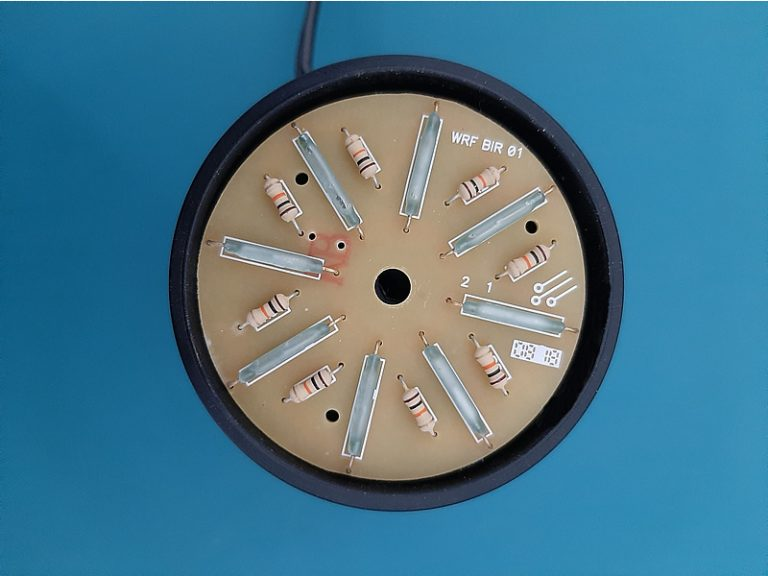
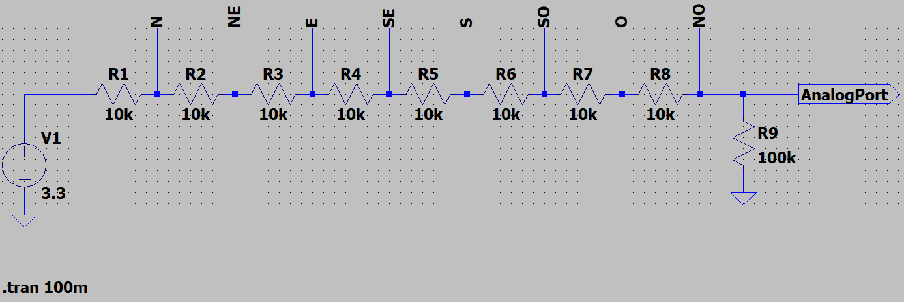

# Sensor de direção do vento

## 1. Definição do modelo

Como este sensor observa as características do complementares do vento em relação ao anemômetro, sua justificativa de utilização é a mesma do referido. Como requisitos específicos, temos a capacidade de aquisição dos dados de pontos cardeais e colaterais. Em relação a saída dos dados, tem-se como padrão de mercado o formato analógico, o que fomentou a escolha deste tipo de saída de dados. De maneira complementar, aspectos como a durabilidade, disponibilidade e custo-benefício foram observados no momento de escolha do sensor. Desta forma, temos o Indicador de Direção do Vento - DV10, desenvolvido nacionalmente pela Wrf Comercial, como opção escolhida. 

## 2. Especificações técnicas

|Característica|Dado|
|-|-|
|Modelo|DV10|
|Tensão de trabalho|5 Vcc|
|Tipo de dado|Analógico|
|Giro|360º|
|Precisão|~95%|
|Meio de transmissão|Cabo|
|Comprimento do cabo|10m|
|Sensibilidade|0,25 m/s|
|Material|Alumínio|

## 3. Detalhamento técnico e cálculos

Este sensor de direção de vento, também chamada de biruta ou indicador de direção, possui seu funcionamento baseado em um divisor de tensão controlado por chaves magnéticas. Para cada uma das oito direções observadas, existe um resistor de 10kOhm e um reed switch ligado ao terra, enquanto, acoplado ao eixo, há um imã, de forma com que, a depender da direção, um reed switch é ativado, tendo como saída um certo nível analógico correspondente a tensão dividida até aquele ponto.

       
A divisão de tensão resistiva é dada pela seguinte equação:

})

Onde:

 = tensão de saída do sensor [Volt];

 = entrada analógica do sensor [Volt];

 = resistores antes e depois do ponto de aquisição de dados [Ohm];

Em uma situação com múltiplos resistores, o termo R_2 torna-se a soma das V_{saida}, enquanto R_1 vira a soma das resistências posteriores a V_{saida}, o que corresponde a situação observada no sensor.

Assim, o dado esperado é analógico que representa um dado nível de tensão. Entretanto, existe uma dependência do valor de saída em relação a tensão de alimentação do sensor. Além disto, o conversor ADC (\textit{analog to digital converter}) do microcontrolador influencia no seu valor, visto que a quantidade de bits do ADC faz com que haja diferença na resolução dos dados, sendo que quanto mais bits houver, maior a resolução. Assim, podemos calcular o valor de tensão de entrada na porta analógica através da equação:

Onde:

 = tensão de saída do sensor [Volt];

 = saída analógica do sensor [bits];

 = tensão da alimentação do sensor[Volt];

 = resolução do ADC [bits].

Por fim, para que haja a correta interpretação dos dados, é necessário que:

1. Seja definido um norte do sistema;
2. Os valores de saída sejam obtidos, observando a tensão de alimentação e a resolução do ADC;
3. Seja feita uma relação entre tensão de saída e ângulo;
4. Esta relação seja codificada no microcontrolador.

Para exemplificar, foi realizada a prototipação do sistema simulado. Assim, o ponto norte foi definido como o maior valor de saída, como pode ser observado abaixo, com as direções cardeais e colaterais sendo atribuídas girando, no sentido horário, a rosa dos ventos, realizando, desta forma, o primeiro passo para a correta interpretação dos dados.

 Para o segundo passo, o circuito foi implementado, utilizando os mesmos parâmetros de tensão e resistor de pull-down como demonstrados acima, e com auxílio de um Arduino Uno, visto que o mesmo possui um ADC de 10 bits, igual a MSP430 que desejamos utilizar, bem como mesmo nível de tensão e uma abordagem mais rápida de implementação. Assim, podemos realizar o comparativo do terceiro passo, conforme demonstrado abaixo, com sua codificação sendo realizada a posteriori.
 
 |Tensão observada (V)|Tensão simulada (V)|Direção/ângulo
 |-|-|-|
|3,09|3,11|Norte/0°|
|2,89|2,93|Nordeste/45°|
|2,61|2,75|Leste/90|
|2,42|2,56|Sudeste/135º|
|2,26|2,38|Sul/180º|
|2,12|2,20|Sudoeste/225°|
|1,99|2,01|Oeste/270°|
|1,88|1,83|Noroeste/315°|
