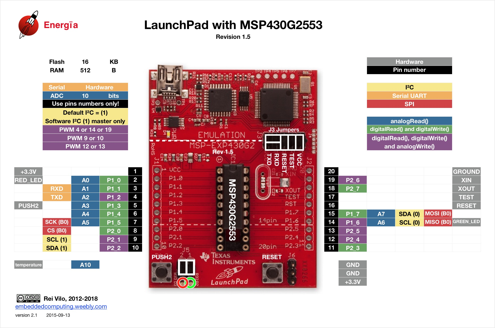

# Sistema de aquisição de dados

## 1. Definição do modelo

Para o sistema de aquisição de dados, escolheu-se a MSP430G2ET, que é um microcontrolador desenvolvido pela Texas Instrument, adequado para aplicações remotas devido ao seu baixíssimo consumo. Possui 20 pinos GPIO, sendo 8 pinos de leitura ADC de 10 bits, acesso as comunicações SPI, I2C e UART, alimentação típica de 5V ou 3.3V via entrada USB, 5 modos de funcionamento e 4 tipos de clock possíveis, o que a torna uma ferramenta extremamente adequada a problemática apresentada pelo projeto.

Seus modos de economia de energia chegam a trabalhar com o mínimo de 0.1uA (RAM retention), com um modo StandBy de 0.5uA e modo ativo utilizando de 230uA a 1MHz. Analisando o consumo de placas como a ESP12-E, que possui 80 mA de consumo médio, e o Arduino Uno com 45 mA de consumo médio, a MSP430 possui um consumo 200 vezes menor que o Arduino. Tratando-se de um sistema com alimentação remota, o baixo consumo se torna uma vantagem competitiva imensa em relação aos outros microcontroladores. 

Além disso, a alta complexidade de programação em relação aos concorrentes citados anteriormente, além da baixa existência de referências online, apesar de serem desvantagens para os desenvolvedores, se tornam vantagens comerciais, visto que é possível gerar um maior valor agregado ao sistema como um todo ao utilizar de uma tecnologia de acesso limitado e especializado, visto que transforma o desenvolvimento que passa do status de “hobby de fácil acesso online” para a prestação de um serviço técnico altamente capacitado.

## 2. Especificações técnicas

|Característica|Dado|
|-|-|
|Alimentação|1,8Vcc a 3,6Vcc|
|Consumo|230 $\mu$A a 1MHz, 2,2V|
|Arquitetura|RISC de 16 bits, com ciclo de instrução de 62,5 ns|
|Memória Flash|16 kB|
|Memória RAM|512 B|
|Clocks|um clock interno de até 16 MHz, um oscilador interno de baixo consumo, um cristal de 32 kHz e a clock digital externo|
|Modos|Cinco modos _power-saving_, como modo de retenção da RAM consumindo 0.1 $\mu$A|
|Interface de comunicação serial universal (USCI)|LIN, IrDA, SPI e I2C|
|Conversor analógico para digital (ADC)|10 bits 200-kbps |
|Erro típico não ajustado do ADC|+-2 LSB|
|Erro máximo não ajustado do ADC|+-5 LSB|

## 3. Detalhamento técnico e cálculos

Visto o menor erro de conversão da MSP430, as aquisições de dados dos sensores analógicos foram todas realizadas nele, cujo erro total desajustado máximo é de +-5, enquanto o da ESP 32 é de +- 12. Além disto, como os sensores digitais necessitam de um cuidado muito fino quanto ao período de aquisição de dados, os mesmos foram adquiridos utilizando a MSP430, visto sua capacidade de interrupção. O código com a implementação da máquina de estados descrita a seguir se encontra [aqui.](https://github.com/PI2-viticultura/SmartVit-electronic-module/blob/master/msp/main.c)

Para o completo entendimento dos testes para a MSP430, é necessário entender a máquina de estados do sistema, que pode ser visualizada na figura abaixo.

De maneira simplificada, o que acontece na máquina de estados está descrito abaixo:

### Estado 01 - Setup 

Este estado é o estado inicial, unicamente alcançado quando se liga a MSP430 pela primeira vez. Nele acontecem as configurações de cada uma das portas do sistema, ajustando-as para as suas funções que serão utilizadas ao longo do código, como as configurações da comunicação UART, do conversor analógico-digital, do temporizador, bem como dos pinos que não serão utilizados.

### Estado 02 - clearOutput

Este estado é responsável por limpar todas as variáveis antes de iniciar a aquisição de dados. Isso é vital para evitar com que informações de coletas anteriores sejam enviadas, caso ocorra algum erro na coleta. Desta forma, garantimos que, caso uma coleta de dados não seja efetivamente realizada, o viticultor estará ciente disso, ao invés de receber um dado enganoso. Idealmente, a implementação de uma tratamento de exceção seria a solução mais adequada, identificando cada tipo de erro esperado para cada tipo de sensor. Entretanto a linguagem C não possui esta forma de tratamento, o que torna a sua implementação mais complexa e trabalhosa, desta forma impossibilitando a implementação no prazo desejado. 
Este estado, em especial, pode ser chamado a partir de dois outros: setup e sleepMode, visto que demarca o início do processo de aquisição de dados. Independente de qual estado o aciona, sua execução será sempre a mesma. Após o término de todas as suas rotinas, o estado getAnemometer é acionado.

### Estados 03 e 04 - getAnemometer e getPluviometer}

Estes dois estados possuem o seu funcionamento de maneira semelhante, o que possibilita a sua explicação de maneira unificada, visto que ambos dados são digitais. Após a mudança de estado, a MSP430 entra em modo de repouso com as interrupções externas e de tempo habilitadas. Desta forma, são duas as entradas esperadas:

- A partir da entrada digital, o recebimento de um pulso, tanto da rotação do anemômetro quanto do acionamento do pluviômetro. Estes pulsos acionarão a interrupção, que é responsável por contabilizar a quantidade de pulsos.
- A partir do timer interno, um determinado período de tempo, como um minuto, será contado. Após a realização deste tempo, a interrupção temporal será acionada, desabilitando o acionamento de interrupções e transferindo o valor de pulsos contabilizados para a variável de destino.

Para controlar a temporização, o clock utilizado será o ACLK, visto que ele trabalha em baixa frequência a partir de um cristal de 32768Hz, além de trabalhar neste modo de consumo reduzido, com consumo típico de 0.5 $\mu$ A. Para isto, selecionando a divisão do clock por 8 no registrador BCSCTL1 e novamente realizando esta divisão no registrador do temporizador (TACTL), ficamos com o clock resultante de 512Hz. Considerando que desejamos esperar um longo tempo, quando comparado ao clock, quanto menor o mesmo for, melhor para otimizar o consumo. 

Assim, obtermos o número de vezes que o sistema acionar a interrupção através do registrador TACCR0 realizando o seguinte equacionamento:

%20-%201)

Onde:

 = tempo desejado [s];

 = Frequência do clock [Hz];

Obtemos, assim, um valor de TACCR0 de 30719 para um intervalo de um minuto.

### Estados 05 a 10 - getWindVane, getTemperature, getPh, getMoisture1, getMoisture2 e getMoisture3

O funcionamento destes quatro estados, semelhantemente ao que ocorre com os estado citados anteriormente, é parecida, de forma que a explicação unificada é cabível, visto que todos os dados são analógicos. Nestes estados, a aquisição dos dados ocorre através da conversão analógica-digital dos sinais de entrada. Para isto, a conversão ADC é habilitada e a porta desejada é escolhida; então a conversão ADC é iniciada e o a amostragem começa. Após o dado ser armazenado no registrador ADC10MEM, o mesmo é transferido para a variável destino adequada. Por fim, o ADC é novamente desabilitado, para evitar possíveis conflitos de leitura e consumo excessivo de energia pelo microcontrolador.

### Estado 11 - sendData

Neste estado ocorre a transmissão dos dados coletados pelos sensores e armazenados na MSP430 para a LoRa ESP32 via protolo UART. Para isto, os pinos RX e TX da MSP430 e a transmissão UART é habilitada. Como esse protocolo é uma comunicação serial e temos apenas uma porta de comunicação,

Para a seleção da frequência do clock e o baud rate de transmissão, foi observado qual é a melhor combinação no que diz a erro, sendo quanto menor o erro, melhor. Dito isto, visualizando a tabela presente abaixo, a combinação de 12 MHz e 9600 baud rate foi considerada ideal, visto o erro máximo TX percentual de zero, eliminando qualquer erro de transmissão de dados neste sentido, o que aumenta a robustez e a precisão do produto, em detrimento do consumo energético. Uma explicação mais detalhada sobre o cálculo do erro pode ser encontrado na documentação referente a família da MSP430.

|BRCLK Frequency [Hz]|}Baud Rate [Baud]|UCBRx|UCBRSx|UCBRFx|Maximum TX Error [%]|Maximum RX Error [%]|
|-|-|-|-|-|-|-|
|32,768|9600|3|3|0|-21.1|15.2|-44.3|21.3|
|1,048,576|9600|109|2|0|0|-0.2|0.7|-1|0.8|
|1,000,000|9600|104|1|0|-0.5|0.6|-0.9|1.2|
|4,000,000|9600|416|6|0|-0.2|0.2|-0.2|0.4|
|8,000,000|9600|833|2|0|-0.1|0|-0.2|0.1|
|12,000,000|9600|1250|0|0|0|0|-0.05|0.05
|16,000,000|9600|1666|6|0|-0.05|0.05|-0.05|0.1|

### Estado 12 - sleepMode

Finalmente, neste estado a interrupção por tempo é novamente acionada e a MSP430 é colocado em modo de baixo consumo 3 (_low-power mode 3_), no qual a CPU, o gerador DC e os clocks principal, sub-principal são desabilitados. Desta forma, mantemos o menor consumo possível do microcontrolador nos momentos em que não está coletando ou enviando os dados. Após o período de tempo definido como adequado sem a aquisição de dados, como quinze minutos, a interrupção por tempo é acionada, acordando o microcontrolador do estado de repouso, retornando assim ao ciclo de aquisição e transmissão de dados. Para realizar a temporização, a lógica utilizada neste ponto é a mesma da informada no estado 03 e 04, sendo que o resultado obtido é de 460799 para um intervalo de 15 minutos.
