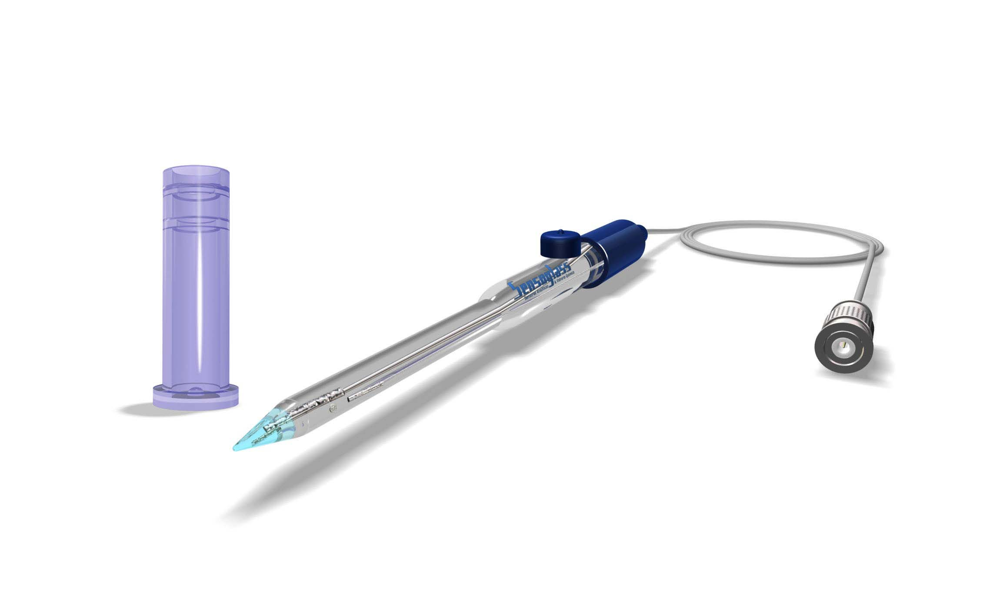
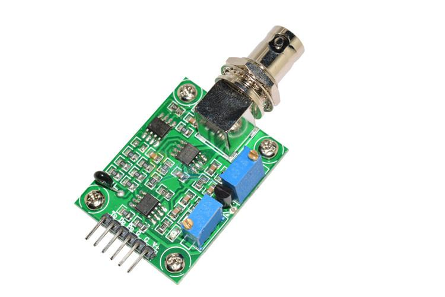

# Sensor de temperatura e PH do solo

## 1. Definição do modelo

O pH do solo é um parâmetro importante na agricultura, uma vez que ele está associado diretamente com a composição do solo e impacta na nutrição e saúde de uma cultura. Sua medida é influenciada pela concentração de macronutrientes (Potássio, Nitrogênio, Cálcio, Magnésio, Enxofre e Fósforo), sendo estes associados com as necessidades de cada tipo de cultura. O equilíbrio e concentração de cada macronutriente presente no solo está ligado ao tipo de cultura e suas necessidades de nutrição. A medida de pH é um dado elementar, uma vez que ele serve como indicador para correção e adubação de solo.

O pHmetro é dividido entre ponta de prova (eletrodo), módulo conversor e microcontrolador. O eletrodo é escolhido a partir de condições iniciais de análise como, por exemplo, tipo de solução de análise (solo), para determinar qual especificação do eletrodo a ser utilizado. Visando a coleta de pH e temperatura do solo, de caráter ácido e possuindo pH entre 5.5 e 6 (solo sem correção), de coleta contínua, então faz-se necessário a escolha de uma ponta de prova com corpo de vidro e ponta cônica, tendo como opção de mercado o modelo SC02.

O módulo pH4502c responsável por receber os impulsos elétricos do eletrodo conectados via conector BCN, se trata de um circuito integrado no qual faz a captação da informação tanto de pH quanto temperatura e transforma isso em dados legíveis e compreensíveis analógicos para serem enviados ao microcontrolador, para um novo processamento e refino.

## 2. Especificações técnicas

|Característica|Dado|
|-|-|
|Modelo|PH4502C|
|Tensão de aquecimento|5 Vcc +- 0,2 Vcc|
|Corrente de trabalho|5-10 mA|
|Faixa de operação|0-60 ºC|
|Tempo de resposta|5 s|
|Tipo de dado|Analógica|
|Faixa de medição|0,00 ~ 14,00 pH|
|Zero pontos|7 +- 0.5 pH|
|Erro alcalino|0.2 pH|
|Resistência interna|250 MOhm|

|Característica|Dado|
|-|-|
|Modelo|SC01|
|Material|Vidro|
|Conector|BNC|
|Faixa de medição|0,00 ~ 14,00 pH|
|Temperatura de operação|0-90 ºC|
|Bulbo sensor|Pontiagudo|
|Diafragma|Pontual|
|Sistema de referência|Ag/AgCl|
|Eletrólito de referência|KCl 3Mol saturado com AgCl|
|Zero pontos|7 +- 15 mV|
|Slope|> 97%|

## 3. Detalhamento técnico e cálculos

Para a aquisição dos dados de temperatura do solo, que são analógicos, temos a equação

Onde:

 = tensão de saída do sensor [Volt];

 = saída analógica do sensor [bits];

 = tensão da alimentação do sensor[Volt];

 = resolução do ADC [bits].

Para o sensor de ph, a aquisição de dados deve ser ao longo de um período de cerca de dois minutos, com coleta de amostras em espaços de tempo iguais ao longo desde período. Isso é necessário para que haja uma estabilização dos dados pelo sensor, de forma com que a informação seja a mais precisa possível.

Sendo assim, uma conversão da equação demonstrada acima deve ser adequada ao número de amostras, o que podem ser observado abaixo.

}{ADC\times%20s})

Onde:

 = tensão de saída do sensor [Volt];

 = saída analógica do sensor [bits];

 = tensão da alimentação do sensor[Volt];

 = resolução do ADC [bits]

 = Número de amostras obtidas [adimensional].

Após, o valor encontrado deve ser ajustado a uma constante, conforme determinação da fabricante. Nesta sessão, é possível realizar ajustes de calibração, conforme for encontrado a necessidade pela curva de calibração do sensor.

Onde:

 = tensão de saída do sensor calibrada [Volt];

 = tensão de saída do sensor[Volt];

 = Coeficiente de calibração [adimensional].