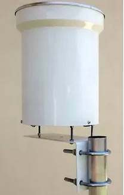
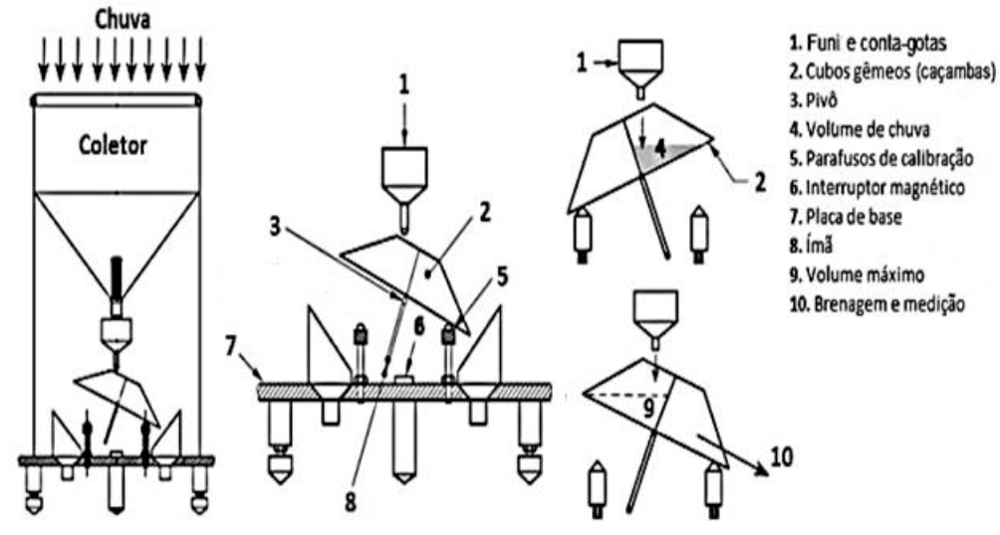

# Sensor pluviométrico

## 1. Definição do modelo

O controle hídrico da viticultura é essencial, visto que diferentes etapas do plantio exigem diferentes quantidades de água. Assim, o conhecimento da precipitação na plantação influencia diretamente no processo decisório de acionamento ou não do sistema de irrigação, a depender do período do ano. Desta forma, o sensoriamento da pluviometria serve como complemento ao sensoriamento de umidade do solo, sendo um ponto de apoio vital nas tomadas de decisão de irrigação.

Para a escolha do anemômetro, foi escolhido é do tipo _tipping rain gauge_, ou contato seco, visto a sua maior disponibilidade e acessibilidade no mercado, sem uma grande perda associada. Como resolução mínima foi determinado 0,25mm, resolução esta comumente utilizada em estações meteorológicas. Além disto, devido ao modo construtivo do sensor, a opção oferecida no mercado é de saídas digitais, o que foi acatado. Além disso, aspectos como a durabilidade, disponibilidade e custo-benefício foram observados no momento de escolha do sensor. Com isso em mente, temos como a opção escolhida o sensor pluviométrico PL2, da Wrf Comercial.

## 2. Especificações técnicas

|Característica|Dado|
|-|-|
|Modelo|PL2|
|Tensão de trabalho|5 Vcc|
|Tipo de dado|Digital|
|Resolução|0,25 mm (ajustável)|
|Diâmetro coletor|155 mm|
|Ângulo do funil coletor|45º|
|Meio de transmissão|Cabo|
|Comprimento do cabo|10m|
|Material|Alumínio|

Dados quanto a precisão do sensor não foram informados pelo fabricante, entretanto, é possível deduzir este erro a partir da análise da construção do sensor. Observando sensores com processo construtivo semelhante disponíveis no mercado, é possível quantificar um erro padrão de 1% de acurácia a 50 mm/h para este sensor, visto que não há diferença quanta tecnologia apresentada nestes sensores observados em relação ao utilizado no projeto.

## 3. Detalhamento técnico e cálculos

O sensor pluviométrico de contato seco, ou pluviômetro, possui um princípio de funcionamento físico semelhante ao anemômetro, em que, a cada ciclo completado, uma chave magnética é acionada, emitindo um pulso de sinal, conforme demonstrado na simulação do anemômetro.

Sua dinâmica de acionamento funciona da seguinte maneira. A água é capturada pelo coletor, sendo forçada a descer pelo funil até um dos cubos gêmeos, que ficam enchendo até atingir o volume máximo de chuva, o que corresponde a resolução do sensor. Após atingir este nível crítico, o cubo gêmeo abaixa, permitindo a saída da água e é parado em um dos parafusos de calibração. Ao realizar este movimento, o imã acoplado ao pivô aciona o interruptor magnético, que fica instalado no centro da placa de base, criando um pulso de sinal.

Dito isto, para calcular a quantidade de chuva observada em um dado tempo, necessitamos da quantidade de acionamentos do reed switch em um dado período de tempo, multiplicando este valor pela resolução do sistema, conforme observado na equação abaixo. Esta medição é dada em mm/h no SI.

Onde:

 = Quantidade de chuva no período [mm/h];

 = número de acionamentos [adimensional];

 = resolução do sensor [mm] ;

 = período de coleta de dados [hora]; 

Para este sensor, é importante lembrar que o período de aquisição de dados na MSP430 é de 1 minuto. Desta forma, o período de coleta deve ser adequado para a unidade no SI de cada sensor, sendo multiplicado para chegar em hora no caso do pluviômetro.

Como circuito foi utilizado do optoacoplador 4N25 como estágio de condicionamento de sinal, realizando a função de isolamento elétrico. Como a tensão de alimentação do sensor é maior do que a do microcontrolador, este isolamento proporciona uma segurança à porta de entrada do sensor, visto que possíveis picos de tensão poderiam queimar a porta da MSP. Além disso, o sinal vindo direto da alimentação está menos suscetível a rúido e perdas do que o sinal vindo do sensor, devido ao menor comprimento dos cabos.
