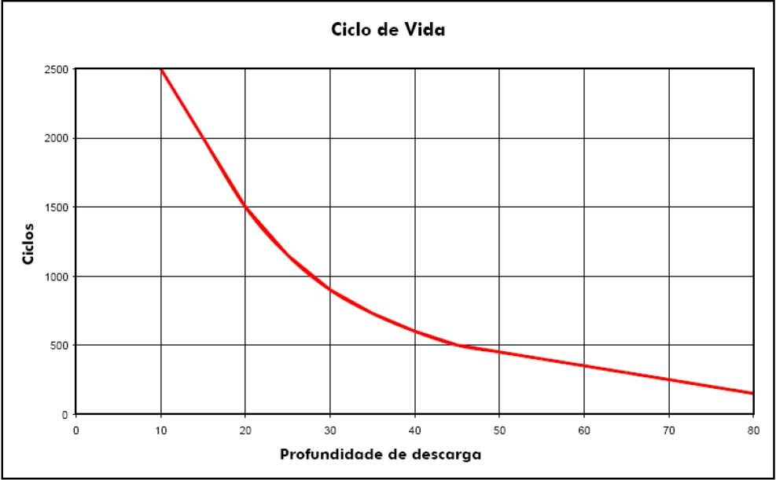
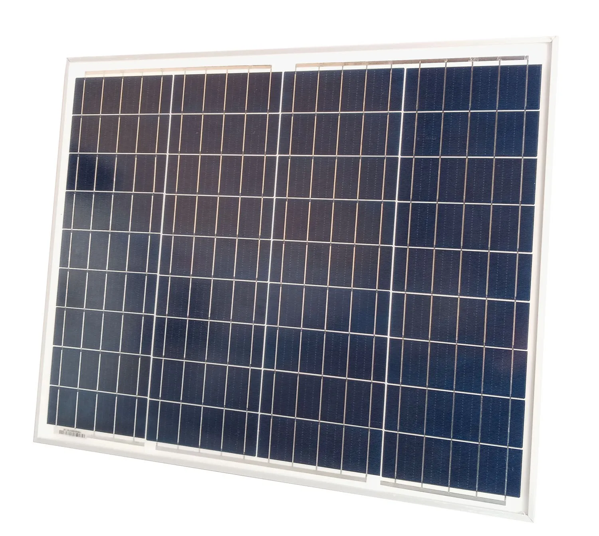
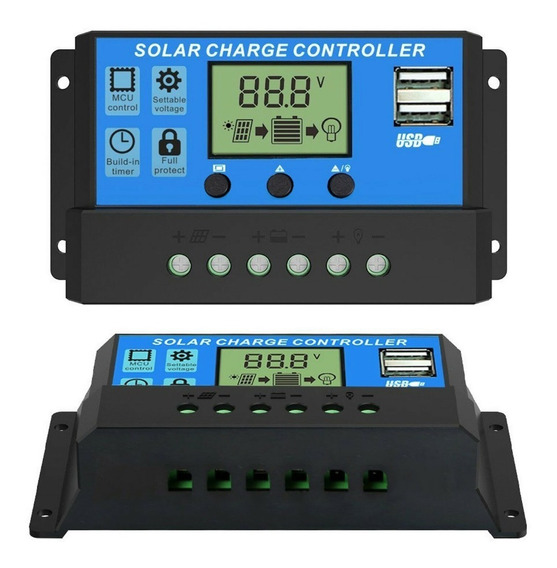
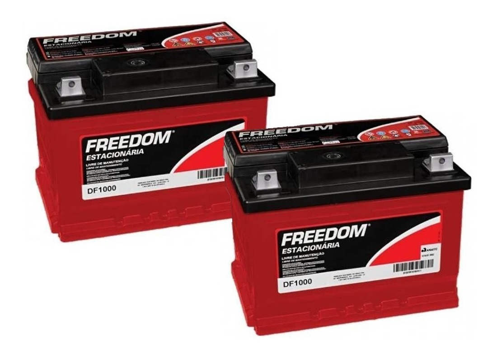
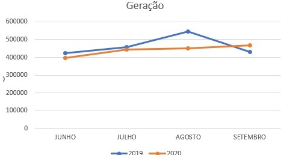
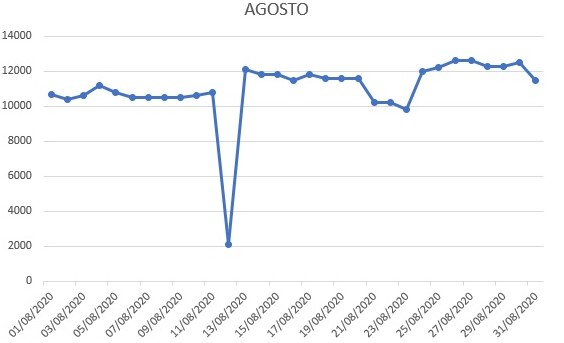

# Sistema de alimentação

## 1. Definição do modelo

A utilização de uma turbina eólica possui inúmeros requisitos que são modificados de acordo com a localização do projeto, além de destaque para uma necessidade de preparação maior para a instalação do aerogerador, dentre eles: 

- Montagem das ferragens; 
- Montagem das conexões civis e elétricas indispensáveis para a transmissão de energia; 
- Concretagem da base.

Todo esse estudo particular, a cada caso, com requisitos de vento, na ordem de no mínimo 7 m/s, relevo baixo, vento contínuo sem grandes turbulências e investimento inicial alto, inviabilizando o projeto.

Outro sistema estudado foi o gerador a diesel. Tal forma de geração foi descartada pela poluição, necessidade constante de abastecimento, o que requer uma infraestrutura com postos preparados para o abastecimento perto  do consumidor e o consumo, o qual ainda é aumentado por necessitar de um veículo que terá que se deslocar até o posto de abastecimento para buscar, em recipiente homologado pelo Instituto Nacional de Metrologia, Qualidade Tecnologia (Inmetro) pela, o diesel necessário. Aliado a isso essa necessidade de reabastecimento constante deve entrar na estrutura de planejamento do projeto e sua falta pode comprometer o devido funcionamento do sistema, bem como por ser mecânico, a necessidade de manutenção preventiva ou corretiva se torna um caráter crítico, essencial e custoso.

Portanto o sistema escolhido, será o fotovoltaico off-grid (desconectado da rede), pela universalização da sua utilização, sendo necessárias poucas ou nenhuma modificação, pela localização do projeto ou outras intercorrências de demanda. Aliando o preço e o custo benefício se comparado com os outros dois sistemas, se mostra o mais vantajoso, além de solicitar apenas uma limpeza simples dos painéis e troca das baterias no tempo estipulado, geralmente em torno de 4 anos, podendo ser prorrogado analisando as taxas de descargas da bateria como mostrado na figura abaixo.

## 2. Especificações técnicas

|Característica|Dado|
|-|-|
|Modelo|Sun Energy SE50W|
|Potência Máxima|50 Wp|
|Tensão Máxima Potência|18,15 Vcc|
|Corrente Máxima Potência|2,76 A|
|Tensão em Circuito Aberto|21,96 Vcc|
|Corrente em Curto Circuito|2,99 A|
|Eficiência do Módulo|13,74%|
|N° de Células|3 x 12|
|Peso|4,2kg|
|Temperatura de operação nominal da célula}|47+-2 ºC|
|Dimensões|545 x 668 x 25mm|

|Característica|Dado|
|-|-|
|Modelo|Controlador de carga Honorall 30 A|
|Tensão da bateria|12V / 24V Auto Adapt|
|Material|ROHS + ABS|
|Corrente de carga|30 A|
|Saída USB|5V 2A|
|Peso|260 g|
|Dimensões|175 x 75 x 40 mm|

|Característica|Dado|
|-|-|
|Modelo|Bateria Freedom DF100|
|Capacidade a 25°C (100h)|70 Ah|
|Tensão de Flutuação a 25°C|ROHS + ABS|
|Corrente de carga|13,2 a 13,8 Vcc|
|Tensão de Carga/ Equalização a 25°C|14,4 a 15,5 Vcc|
|Compensação de Temperatura|1 ºC +- 0,033 Vcc|
|Peso|14,7 kg|
|Dimensões|274 x 175 x 175 mm|

## 3. Detalhamento técnico e cálculos

### 3.1 Dimensionamento do sistema solar

Para a complexidade do projeto e dos componentes eletrônicos presentes no projeto e devido à baixa carga necessária para o pleno funcionamento. É necessário obter uma confiabilidade operacional, por se tratar de uma geração intermitente e para tanto a escolha do painel fotovoltaico, bem como da bateria são de fundamental importância. 

Para os cálculos e escolha dos componentes, foi necessário saber o consumo total mensal e diário do projeto, de forma que a tabela a seguir ilustra bem o consumo de cada componente e o consumo em Ah, com a multiplicação do consumo em corrente (A) pelo tempo de utilização e o consumo diário feita pela multiplicação da potência máxima pelo tempo de utilização, na qual foi admitido como tempo de utilização as 24 horas.

|Equipamento|Consumo máximo (A)|Tensão máxima (V)|Potência máxima (W)|Consumo (Ah)|Consumo (Wh/dia)|
|-|-|-|-|-|-|
|Lora ESP32 - Micro|0,5|3,6|1,8|12|43,2|
|Lora ESP32 - Transmissão|0,13|3,7|0,481|3,12|11,544|
|Display OLED|0,016|5|0,08|0,384|1,92|
|MSP430G2553|0,00042|3,6|0,001512|0,01008|0,036288|
|PH4502|0,0015|5,5|0,00825|0,036|0,198|
|Sensor capacitivo umidade solo|0,005|5,5|0,0275|0,12|0,66|
|Anemômetro|0,005|5|0,0025|0,012|0,06|
|Pluviômetro|0,0005|5|0,0025|0,012|0,06|
|Biruta|0,00006|5|0,0003|0,00144|0,0072|
|BME280|0,001404|3,6|0,0050544|0,033696|0,121306|
|Módulo Micro SD|0,2|5|1|4,8|24|
|Módulo relé|0,02|5|0,1|0,48|2,4|
|Válvula solenoide|1|12|12|0,1|3,6|

Na tabela abaixo podemos ver o consumo total diário, adotando-se a soma do consumo diário da tabela anterior e para o consumo mensal a multiplicação do consumo diário pela média de 30 dias mensais. Dentre os equipamentos utilizados apenas a válvula solenoide tem um tempo diferente de uso, sendo esse tempo de aproximadamente 5 minutos , em média, por dia.

|Consumo|Valor|
|-|-|
|Consumo Total Diário|89,52279|
|Consumo Total Mensal|2685,684|

De acordo com a literatura para o cálculo da potência mínima de pico do projeto, a ser fornecido pelo painel fotovoltaico, deve seguir a equação abaixo:

=\frac{Consumo(Wh/dia)}{H(h/dia)\times%20F_{pp}\times%20F_{ps}})

Adotando-se para os cálculos o Consumo diário de 90 (Wh/dia), conforme calculado anteriormente. Para H foi estipulado de acordo com a média de irradiância mensal do pior mês para o plano inclinado para a região de Brasília com latitude de  15º46'48'' Sul e longitude de 47º55'45'' Oeste, obtemos uma média, para o pior mês e para o plano inclinado de 16graus Norte, de 4,76 horas de sol pleno (CRESESB). Para o Fator de perda de potência, o cálculo é a tensão a ser adotada pela bateria pela tensão máxima potência fornecida pelo módulo a ser adotado, no caso de 50 Watts, ou seja, (12V/17,74V= 0,6764) Fpp=0,6764. Para o Fator de perdas e segurança, na qual leva-se em conta as perdas por poeira, temperatura, fiação, fabricação, degradação e dessa forma adota-se comumente 0,8. 

Quanto ao painel a escolha se deve a um painel de aproximadamente 34,94Wp no mínimo, para suprir tanto a carga necessária durante o dia e o devido carregamento da bateria, assim como para preservar o equilíbrio de carregamento e descarregamento necessário à uma proteção a vida da bateria e portanto, foi então adotado um painel de 50Watts-pico.

A bateria escolhida foi de chumbo-ácido de acordo com a carga necessária, frisando haver o dimensionamento, de forma que o descarregamento possa ser dentro dos parâmetros especificados pelo seu manual técnico. A preservação da vida útil da bateria é parte de um entendimento sustentável, considerando o descarte correto ao final, mas ao ser analisada a profundidade de descarga da bateria pelo números de ciclos acima, pode-se constatar que entre 10 e 20 por cento de descarga por ciclo chega próximo ao número máximo teórico de ciclos, entre 1500 e 2500, fora deste intervalo o decaimento da vida útil é mais acentuada e deve ser considerada relevante para a inviabilidade ou o incorreto dimensionamento do projeto. Para tanto outras tecnologias de baterias estacionárias não encontram viabilidade e confiabilidade necessária para a adequação ao correto funcionamento.

Para o cálculo do dimensionamento da bateria foi utilizada as seguintes equações:

=%20\frac{Consumo(Wh/dia)}{Tensao(V)%20\times%20Descarga(pu)})

=\frac{Consumo(Wh/dia)%20\times%20Autonomia(dias)}{Tensao(V)%20\times%20Descarga(pu)})

Tendo o consumo diário já calculado anteriormente, de 85Wh/dia (Watt-hora/dia), a tensão do conjunto de baterias adotada, até pelo motivo de haver apenas um painel gerando energia, foi de 12 V (Volts), a profundidade de descarga utilizada foi de 0,2, que seria uma média de no máximo 20 por cento de descarga por dia, de forma a proteger a vida útil da bateria. Então para a primeira equação de capacidade, temos como resultado, aproximadamente 37,5Ah (Ampére-hora). Para o cálculo da segunda equação de capacidade, acrescenta-se apenas a autonomia em dias, considerando eventual problema na alimentação, de 5 dias e sendo proporcional a capacidade da bateria além de adotar como profundidade de descarga o valor de 0,6, por considerar um tempo maior e esporádico, obtemos, portanto, aproximadamente 62,5 Ah. Portanto foi escolhido a bateria DF1000 da Freedom com capacidade de 70Ah.

Para muitos, o entendimento de sistema fotovoltaico é composto, apenas,  por painel e baterias, por serem os custos mais consideráveis do sistema, mas para o correto funcionamento e proteção de todo o sistema, a bateria, a carga e o painel, então, é imperativo a utilização de um controlador de carga, para sistemas off-grid. O controlador de carga é um componente eletrônico que permite o controle da tensão e da corrente. A tensão é controlada para que não haja uma sobretensão desnecessária e prejudicial a bateria ou a carga. A corrente é controlada para poder haver uma utilização total do painel fotovoltaico, de forma a não ter um desperdício de energia do sistema. O tipo de controlador escolhido foi o MPPT (Ponto de Máxima Potência), Honorall de 30A, este permite que a tensão chegue as baterias e a carga ao mesmo tempo, com o máximo de aproveitamento, o carregamento da bateria seja feita controladamente e outra parte da energia proveniente do painel entregue a carga, para tanto serve como um dispositivo de proteção a regulação da tensão contínua no sistema.

Além do controlador, a escolha de cabos e conectores, devem seguir os padrões mercadológicos e de proteção ao sistema, a bitola necessária de acordo com a AWG sugere a dimensão necessária para a tensão requerida, assim a distância aliada a dimensão transversal não crie uma resistência desnecessária e consuma energia do equipamento, nem aumente a temperatura para comprometer outros componentes eletrônicos, poliméricos ou inclusive a bateria. 

### 3.2 Simulação de produção energética

A simulação de geração para um sistema _off-grid_ com o painel de 50 Wp(Watts-pico) um controlador de carga e uma bateria. De acordo com os dados retirados do site do CRESESB é possível saber o tempo em horas, de pico, no qual é obtida a geração de 1000 W/m² (Watts por metro quadrado). Utilizando a equação abaixo:

Onde:

 = Energia em kWh/m²/dia;

 = Potência em kWh/m²;

 = Tempo em horas;

Calculando as médias em horas de energia de pico, ou seja, substituindo E pelo valor encontrado no site, considerando as três localidades pela qual foram feitos os estudos de irradiação e P pelo valor de 1kW/m² obtemos o tempo. Para encontrar a média de geração diária, foi feito a multiplicação do tempo em horas da média diária mensal pela potência do painel, utilizando a mesma equação descrita acima, neste caso, transformado para kW, portanto, 0,05 kWp. Ao multiplicar o resultado anterior por 30 dias, obtêm-se a média de geração mensal, e este último resultado médio somado, por mês, é obtido a média de geração anual. O resultado médio anual é de 102,27 kWh/ano de geração, conforme mostra o gráfico e considerando as perdas de um sistema off-grid de 35%, então será considerada a média de geração anual de 66,456 kWh/ano.

|Meses|Geração Diária|Geração Mensal|
|-|-|-|
|JAN|0,265|7,95|
|FEV|0,2875|8,625|
|MAR|0,2675|8,025|
|ABR|0,281|8,43|
|MAI|0,2845|8,535|
|JUN|0,291|8,73|
|JUL|0,308|9,24|
|AGO|0,336|10,08|
|SET|0,307|9,21|
|OUT|0,282|8,46|
|NOV|0,242|7,26|
|DEZ|0,2575|7,725|

### 3.3 Estudo sobre limpeza dos paineis solares

Para o presente trabalho foi feito uma análise de duas usinas situadas no Distrito Federal, de forma que foi possível tirar conclusões a respeito da limpeza dos painéis, conforme os gráficos demonstrados abaixo.

Ao olhar para o mês de agosto da usina do senhor Leopoldo localizada no Lago Sul, é possível perceber que a diferença de geração comparado ao mesmo mês do ano anterior, portanto houve um decréscimo perceptível em junho e julho, mas foi maior no mês de agosto e a limpeza ocorrida no mês de setembro apresentou o efeito esperado, passando assim a gerar mais energia e alcançando o nível esperado de eficiência.

Para o mês de agosto de 2020, da usina do Senhor Antônio, foi ainda mais perceptível a diferença de geração em dias próximos como o exemplificado. No dia 12 de agosto do mesmo ano foi feito uma manutenção preventiva, na qual foi necessário o desligamento do sistema por um período e feita a limpeza dos painéis. Portanto, ao analisar o dia imediatamente anterior ao dia 12 e o dia imediatamente posterior a esse dia, é possível concluir que houve um acréscimo na geração e que parte desse acréscimo se deveu a operação de limpeza.
Desta forma é possível inferir que o longo período de seca pela qual o Centro-Oeste passa, diminui a eficiência da geração solar pela sujidade dos painéis, de forma que ao menos uma vez ao ano, nesse período é recomendável a limpeza, para o período chuvoso, a própria chuva faz o papel de limpeza, não sendo necessário uma intervenção operacional, e por isso o aumento da diferença de geração de um ano para ou outro é gradativo.

