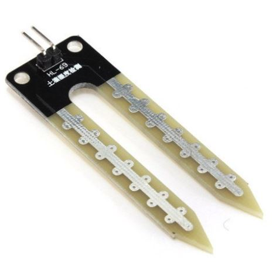
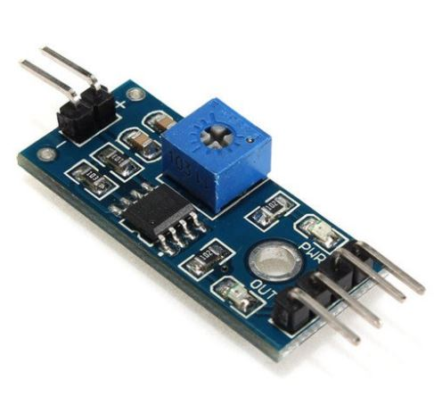

# Sensor de temperatura e PH do solo

## 1. Definição do modelo

A demanda hídrica é um recurso essencial na agricultura e a sua necessidade varia de acordo com o tipo de cultura em produção e também nas diferentes fases de desenvolvimento da planta. Na viticultura, a disponibilidade de recursos hídricos exerce forte influência e impacto em todas as etapas de produção da uva, interferindo até na qualidade do vinho obtido no final da cadeia de produção da vitivinicultura. 

O uso da água pelo vinhedo é caracterizado por uma baixa demanda no início da fase de crescimento e após a colheita, e por uma alta demanda quando o dossel está plenamente desenvolvido. Nesse contexto, o conhecimento da umidade do solo durante as etapas de desenvolvimento da cultura se torna fundamental, no quesito de se obter o produto agrícola dentro dos requisitos de qualidade esperados, e controle do sistema de irrigação afim de se manter dentro dos níveis rigorosamente estabelecidos nesses períodos. 

Sabendo que em solos de umidade controlada e com características combinadas às necessidades da planta, a maior parte das suas raízes ficam a 60 cm do solo. E em solos de baixa umidade, as raízes podem atingir profundidades maiores à 1 m, no entanto impactando a captação de nutrientes e consequentemente alterando as características de composição da uva. 

Nesse aspecto, o sensoriamento do solo foi projetado para coleta de informações em pontos estratégicos da plantação. Sendo disposto na parte superficial do solo, a 60cm e 1m. Sabendo que o solo é rico em nutrientes e de caráter ácido, a solução mercadológica mais adequada para atender tais requisitos se torna o sensor de umidade de solo capacitivo, que possui mais resistência à corrosão e maior vida útil em relação às soluções similares.

O sensor é composto por uma sonda, no qual será inserida no solo nos pontos onde deseja-se fazer a coleta de dados e o módulo responsável por fazer a conversão dos impulsos elétricos em sinais analógicos e digitais. Os sinais analógicos serão enviados ao microcontrolador, enquanto os sinais digitais serão enviados para o sistema de acionamento da irrigação local. 

## 2. Especificações técnicas

|Característica|Dado|
|-|-|
|Modelo|Capacitivo|
|Tensão de operação|3,3 Vcc ~ 5 Vcc|
|Sensibilidade|Ajustável por potenciômetro|
|Tipo de dado|Analógico e digital|
|Comparador|LM393|

## 3. Detalhamento técnico e cálculos

Uma particularidade deste sensoriamento é a necessidade de três sensores iguais para a aquisição dos dados em três níveis de profundidade distintos: nível solo (0 m), intermediário da raíz (0.5 m) e profundo da raíz (1.0 m). Isso é necessário, visto que a umidade varia ao longo da profundidade, em função da absorção da raíz e do solo em si, sendo necessário acompanhar neste nível a uniformidade da umidade.

Como este sensor possui os dois tipos de saída: analógico e digital, ficou a cargo da equipe decidir qual tipo utilizar. Por fim, os dois foram utilizados, mas com funções diferentes.

Para o acionamento do sistema de irrigação, a saída digital foi a mais adequada, visto que o ajuste do limiar é constante, não necessitando um ajuste dinâmico. Desta forma, com o auxílio do CI 74HC08N, a saída em nível lógico alto dos sensores nas profundidades 0,5 m e 1 m demonstra que a umidade está abaixo do limiar nestes dois níveis, necessitando assim a ativação do sistema de irrigação. No caso de um dos dois voltar ao nível lógico baixo, significa que a umidade é suficiente e o sistema de irrigação deve ser desligado.

Para a aquisição dos dados de umidade do solo decidiu-se o uso dos dados analógicos, que podem ser calculados seguindo a equação abaixo.

Onde:

 = tensão de saída do sensor [Volt];

 = saída analógica do sensor [bits];

 = tensão da alimentação do sensor[Volt];

 = resolução do ADC [bits].