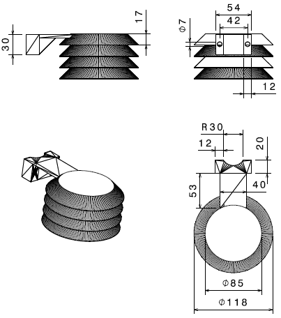
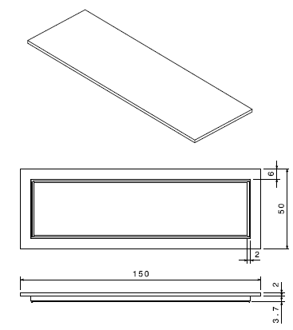
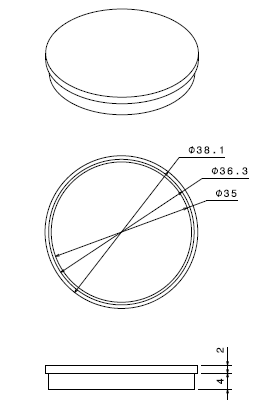
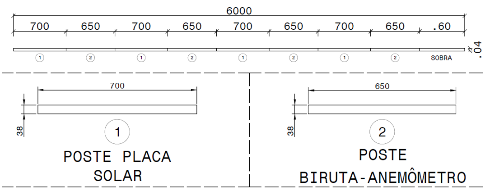
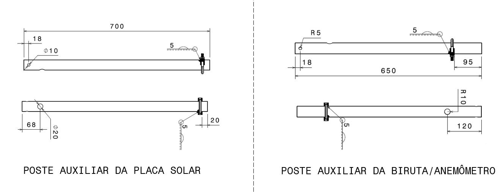
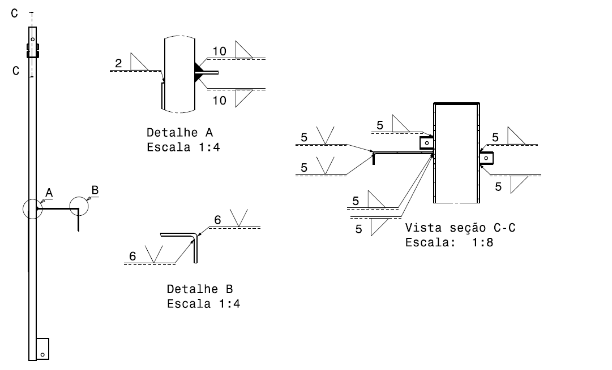

<u>Obs.: ARRUMAR AS REFERÊNCIAS DE FIGURA</u>

 O objetivo desse plano é descrever como deve acontecer a fabricação dos componentes  estruturais do sistema SmartVit.

 A proteção do sensor de temperatura e as tampas do poste principal e dos postes auxiliares serão fabricadas por meio de impressão 3D, e estão apresentadas nas Figuras \ref{fig: shield}, \ref{fig: tampa_poste_principal} e \ref{fig: tampa_poste_aux}

 As barras de aço SAE 1020 comerciais utilizadas para a fabricação do poste principal tem o comprimento de 6 m, com isso é possível obter duas barras de 2,2 m adequadas para a construção do poste. Para cortar esse tipo de perfil é necessário uma serra policorte com um disco dentado em baixa rotação, além disso, a barra deve estar fixada na mesa de corte. Os cortes necessários estão apresentados na figura abaixo:

 Os postes auxiliares, feitos de aço SAE 1020, são comercializados também em barras de 6 m que devem ser cortadas com uma serra policorte da mesma maneira que o poste principal e resultaram em dois postes de comprimentos diferentes: 700 mm para o poste auxiliar da biruta e 750 mm para o poste auxiliar da placa solar. Com a barra com esse comprimento obtém-se 4 pares de postes auxiliares.  Os cortes necessários estão apresentados na figura abaixo:

 As cantoneiras utilizadas na estrutura de apoio da placa solar são comercializadas em barras de 6 m, a partir disso são cortadas com a serra policorte, de forma igual aos postes auxiliares, 3 conjuntos compostos por: 2 cantoneiras de 668 mm, 1 cantoneira de 245 mm e 2 cantoneiras de 31,75 mm. Sendo que apenas um conjunto é necessário por sistema do *SmartViti*, a figura abaixo ilustra os cortes necessários.

 A chapa de fixação do gabinete e a chapa utilizada na sapata do poste serão feitas de aço SAE 1020, a primeira tem dimensões de 400 x 300 x 4,75 mm enquanto a segunda 310 x 160 x 4,75 mm. Esse tipo de chapa é encontrada comercialmente com tamanho de 1,2 x 2 m , de forma que apenas uma será necessária para a construção de ambas as estruturas. Devido ao tamanho da chapa, o corte a laser é o mais adequado para fornecer as peças finais.

 Utilizando o restante da chapa de aço 1020, será cortado também a laser dois pares de chapas com  as medidas de 280 x 80 mm e 140 x 80 mm que serão utilizadas para construir as estruturas em "L", que fixam o pluviômetro e o sensor de temperatura no poste principal. As figuras abaixo  ilustram as peças e os cortes que devem ser realizados.

 A estrutura de fixação do poste auxiliar no poste principal é um perfil UDC  de aço SAE 1008 que comercialmente é encontrado em barras de 6 m de comprimento. Serão necessárias duas estruturas de 45 mm de comprimento para abarcar os dois postes, novamente será utilizada a serra policorte conforme descrito anteriormente. Após o corte no tamanho adequado deve-se fazer um furo de 13 mm, igual ao feito no poste auxiliar, para permitir a passagem do parafuso M12.

 Por fim, é necessário cortar a tábua de madeira pinus que será utilizada para a caixa onde será despejado o concreto para a sapata do poste. A placa escolhida tem dimensões 1,2 x 0,3 m com 17 mm e deverá ser cortada com uma serra circular para madeira de modo a fornecer 2 placas de 300 x 258 mm, 2 placas de 300 x 154 mm e uma placa de 258 x 154 x 17 mm. A figura abaixo apresenta os cortes que devem ser realizados na madeira.

 A tabela abaixo resume os cortes que deverão ser realizados em cada tipo de material:

|                         Material de Entrada                         |                                             Componentes Resultantes                                             |                                       Quantidade utilizada para um sistema                                      |
|:-------------------------------------------------------------------:|:---------------------------------------------------------------------------------------------------------------:|:---------------------------------------------------------------------------------------------------------------:|
| Barra de aço 1020 com seção retangular vazada de 6000 x 150 x 50 mm |                                          2 x Postes principais de 2,2 m                                         |                                               1 x poste principal                                               |
| Barra de aço 1020 com seção circular vazada de 6000 x 38,1 mm       |                         2 x postes auxiliares de 750 mm 2 x postes auxiliares de 700 mm                         |                         1 x postes auxiliares de 750 mm 1 x postes auxiliares de 700 mm                         |
| Cantoneira em L de aço 1020 com 6000 x 31,75 x 31,75 mm             |                  6 x cantoneiras de 668 mm 3 cantoneiras de 245 mm 6 x cantoneiras de 31,75 mm                  |                  2 x cantoneiras de 668 mm 1 cantoneiras de 245 mm 2 x cantoneiras de 31,75 mm                  |
| Chapa de metal de 1,2 x 2 x 0,004m                                  | 1 x chapa de 400 x 300 x 4 mm 1 x chapa de 258 x 154 x 4 mm 2 x chapas de 280 x 80 mm 2 x chapas de 140 x 80 mm | 1 x chapa de 400 x 300 x 4 mm 1 x chapa de 258 x 158 x 4 mm 2 x chapas de 280 x 80 mm 2 x chapas de 140 x 80 mm |
| Barra de perfil UDC de 6 m                                          |                           66 x pares de estruturas de fixação de 4,5 cm de comprimento                          |                            1 x par de estruturas de fixação de 4,5 cm de comprimento                            |
| Placa de madeira pinus de 1,2 x 0,3 m                               |                 2 x placas de 480 x 310 mm 2 x placas de 480 x 240 mm 1 x placa de 310 x 140 mm                 |                  2 x placas de 3 x 258 mm 2 x placas de 300 x 154 mm 1 x placa de 258 x 154 mm                  |

 O próximo passo da fabricação é furar as peças nos locais adequados para passagem de fios, alocação de rebites e alocação dos chumbadores. Começando pela chapa do gabinete onde devem ser feitos 4 furos de 10 mm de diâmetro e em seguida a chapa da sapata de concreto que necessita de 4 furos de 21 mm, a figura abaixo ilustra o posicionamento dos furos das duas peças.

 As próximas estruturas que devem ser furadas são o suporte para a estrutura 3D com dois furos de 7 mm, o suporte para o pluviômetro com 4 furos de 10 mm e os dois perfis UDC utilizados para a fixação do poste auxiliar. A figura abaixo ilustra o posicionamento dos furos dessas peças.

 Em seguida deve-se furar as cantoneiras da estrutura em "H"  conforme ilustrado pela figura abaixo:

 No poste principal é necessário furar as passagens para os fios, além dos furos necessários para os rebites. A figura abaixo indica os seus posicionamentos.

 Os postes auxiliares necessitam de um furo em sua base para a passagem do parafuso que o prenderá no perfil UDC. Além disso, são necessários os furos para a passagem dos fios, a figura abaixo indica os seus posicionamentos para cada um dos postes.

 Para a instalação do rebite para fixação da caixa de proteção da válvula solenóide deve-se utilizar uma rebitadeira pneumática, onde primeiro, escolhe-se um bico adequado, em seguida regula-se a pressão, posiciona-se o rebitador sobre o rebite e aciona-se o interruptor.

 O próximo passo é a soldagem das estruturas auxiliares no poste principal. A primeira etapa é marcar o posicionamento de cada uma, obedecendo a figura acima que mostra os cordões de solda dos postes auxiliares e a figura abaixo mostra as soldas das estruturas no poste principal.

 O processo de soldagem utilizado será o MIG, já que permite uma soldagem mais rápida e sem a formação de escória (ALUMAQ,2018). Para o processo de soldagem MIG são necessários os seguintes componentes (CÉSAR,2018):

* Fonte de energia;
* Fonte de alimentação para o arame;
* Tocha;
* Gás de proteção;
* Regulador de gás;

 A posição de soldagem das estruturas mencionadas acima será a 1F e 2F para as junções na horizontal e 3F para as junções na vertical. Será utilizado o  arame de aço carbono AWS ER70S-6 de  1,2 mm já que pode ser utilizado em aplicações estruturais. A mistura de gases utilizada será de 92% Ar 8% CO~2~ que é indicada para aços carbono no processo com transferência por aerossol (ESAB, 2005) esse que será utilizado por ser indicada para unir materiais com espessuras maiores que 2,4 mm  (ESAB, 2005). Nesse tipo de soldagem a corrente e a polaridade é sempre CC+.

 Além das estruturas serão também soldados cordões de soldas nos postes auxiliares para demarcar a altura na qual devem ser instaladas as braçadeiras. Antes da soldagem deverá ser realizada uma marcação a 10 cm da extremidade do poste do lado que não apresenta o furo, em seguida, o poste será fixado verticalmente com um torno de bancada para que a solda seja realizada em um plano horizontal, na posição chamada 2G. Os parâmetros e o processo utilizados serão os mesmos das demais estruturas.

ESAB. **Apostila de Soldagem MIG/MAG. 2005.**

ALUMAQ. **O que é Solda MIG/MAG? 2018**. Disponível em: <https://www.alumaq.com.br/o-que-e-solda-mig-mag/:. Acesso em: 02 nov. 2020.

CÉSAR, P. **Processo de Solda MIG MAG. 2018**. Disponível em: <https://alusolda.com.br/processo-de-solda-mig-mag/>. Acesso em: 05 de Novembro de 2020.
