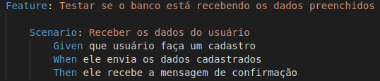

 ## Behaviour Driven Development (BDD)

- [1. Introdução](#_1-introdução)
- [2. Objetivos](#_2-objetivos)
- [3. Aplicação do BDD](#_3-aplicação-do-BDD)
- [4. Aplicação no SmartVit](#_4-aplicação-no-smartvit)
- [5. Referências](#_5-referências)
- [ Histórico de revisão](#_histórico-de-revisão)

### 1. Introdução

 O Behaviour Driven Development, conhecido como BDD, é uma técnica de desevolvimento ágil originado do Test Driven Development (TDD). No BDD o foco é o comportamento do software, com isso, a técnica incentiva que sejam criados cenários a serem testados antes de serem desenvolvidos. A metodologia pode ser realizado com diversos autores do desenvolvimento do produto, não necessariamente apenas os desenvolvedores.

### 2. Objetivos

 O foco em BDD é a linguagem e as interações usadas no processo de desenvolvimento de software. Os desenvolvedores são os principais beneficiados com essas técnicas, escrevendo os testes em sua língua nativa e os combinam com a linguagem onipresente. Isso permite que eles foquem nos motivos do código a ser criado, ao invés de detalhes técnicos, e ainda possibilita uma comunicação eficiente entre as equipes de desenvolvimento e testes.

### 3. Aplicação do BDD

 Para implementar uma nova funcionalidade do BDD utiliza-se a linguagem Gherkin. Gherkin é uma Business Readable Domain Specific Language criada especificamente para a descrição de comportamentos, servindo como documentação do BDD.  Defini-se primeiro as histórias e cenários do que os usuários esperam da funcionalidade. Os usuários ajudam a definir um conjunto de exemplos concretos que possam ilustrar resultados que a nova Funcionalidade (Feature) deve fornecer. Utiliza-se um vocabulário comum onde as expressões são: Cenário (Scenario), Dado (Given), Quando (When) e Então (Then) respectivamente.

 Depois de exemplificada a nova funcionalidade, os cenários serão automatizados sob a forma de especificações executáveis, facilitando a validação do software e fornecendo uma documentação atualizada técnica e funcional.

 Ao utilizar um framework apropriado para aplicação do BDD, deve-se seguir 5 passoas para obter sucesso nos testes.

1. Descreva um comportamento em um
texto simples;
2. Escreva uma definição dos passos em Java
ou em outras linguagens;
3. Execute e veja os passos falharem;
4. Escreva o código para fazer os passos
passarem;
5. Se necessário, refatorar o código ou o
comportamento descrito.

### 4. Aplicação no SmartVit

 Pretende-se utilizar o BDD na aplicação SmartVit através de implementação dos testes de Backend, com isso, será utilizado a ferramenta Behave. Ela possui o processamento padrão da aplicação do BDD e sua implementação dos testes utiliza a linguagem de programação Python.

 Outra vantagem na utilização do Bahave é que ele prevê a criação das funcionalidades (features) para testes sendo possível especificar um ou mais cenários dos testes descritos do BDD.

Figura 1 - Exemplo de implementação de teste do Behave utilizando a descrição do Gherkin.

### 5. Referências

Desenvolvimento Orientado a Comportamento BDD com Cucumber. Disponível em: <http://www.devmedia.com.br/desenvolvimento-orientado-a-comportamento-bdd-com-cucumber/33547>. Acesso em: 10 set. 2020.

Selenium Python Tutorial: Getting Started With BDD In Behave. Disponível em: <https://www.lambdatest.com/blog/selenium-python-behave-tutorial-bdd/>. Acesso em: 14 set. 2020.

# Histórico de revisão

| O quê | Quem  | Quando |
| - | - | - |
|  Primeira versão do documento | João Lucas | 10/09/2020 |
| Adição da Aplicação prevista no SmartVit| João Lucas | 14/09/2020 |
| Adição da imagem do Gherkin | joão Lucas | 8/10/2020 |
| Atualização dos links | Lucas Vitor | 23/11/2020 |
