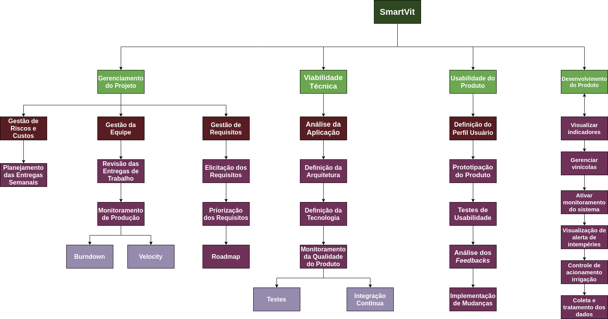

## Estrutura Analítica do Projeto

- [1. Sobre](#_1-sobre)
- [2. A EAP](#_2-a-eap)
- [ Histórico de revisão](#_histórico-de-revisão)

## 1. Sobre

 O documento EAP (Estrutura Analítica do Projeto) consiste em um diagrama com hierarquias, semelhante a um diagrama de classes UML, que comporta os pacotes de atividades a serem desenvolvidas durante o projeto. Nele, obtém-se uma visão macro do que há para ser feito, sendo possível ainda observar o detalhamento de grandes grupos por meio do aninhamento de atividades.

O objetivo dessa documentação consiste em identificar elementos terminais (os produtos, serviços e resultados que estarão presentes em um projeto). Assim, o documento serve como base para grande parte das iniciativas de planejamento do projeto, tendo relevância, principalmente no que diz respeito ao cliente em comunicação com a equipe. 

É importante salientar que pouco mudou na estrutura analítica desde o início da pandemia até o início da disciplina em EAD.

## 2. A EAP

# Histórico de revisão

| O quê | Quem  | Quando |
| - | - | - |
| Primeira versão do documento | João Lucas | 24/04/2020 |
| Revisão entrega | Lucas Vitor | 22/05/2020 |
| Adição de histórico, atualização da EAP | Adrianne Alves da Silva | 25/08/2020 |