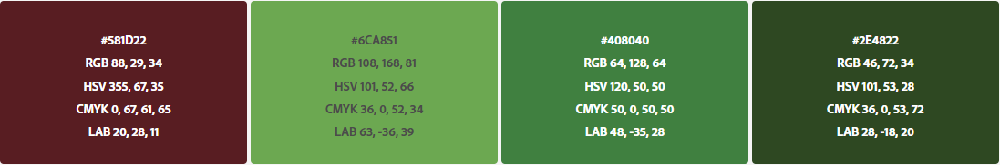

# <a name="Identidade-Visual">Identidade Visual</a>

## 1. <a name="1">Introdução</a>

 &emsp;&emsp; O Documento de Identidade Visual descreve as confecções de design das telas, logo e ícone a partir da aprovação do tema do projeto pelos professores da disciplina de Projeto Integrador 2. Com isso, definindo-se a paleta de cores e tipografia que serão utilizadas na produção da documentação e da aplicação do software. Essas definições têm como objetivo ajudar a uniformizar a experiência do usuário durante o uso da aplicação.

## 2. <a name="2">Paleta de Cores</a>

 &emsp;&emsp; 

 &emsp;&emsp; Para a logo e ícone foi definido um cacho de uvas de cor marsala, onde a intuição de lembrar a coloração de vinhos enquanto as suas folhas, de cores diversificadas de verde, lembram-se uma antena de símbolo _Wi-fi_ para remeter ao sistema do projeto.

 &emsp;&emsp; 

 &emsp;&emsp;  Imagem 1: Logo do Projeto SmartVit

 &emsp;&emsp; 

 &emsp;&emsp;  Imagem 2: Ícone do Projeto SmartVit

## 3. <a name="3">Tipografia</a>

 &emsp;&emsp; A escolha da tipografia na logo foi o Archivo Black, a fonte é utilizada para simular fontes de produtos que envolvem tecnologia e apresenta características e estéticas de demais fontes de alto desempenho.

## 4. <a name="4">Referências</a>

ADOBE, __Adobe Color CC__. Disponível em: <https://color.adobe.com/pt/create/image/>. Acesso em: 18 abr. 2020.
