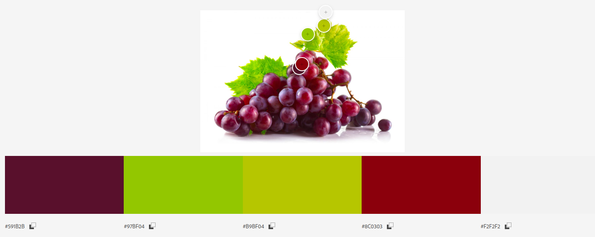
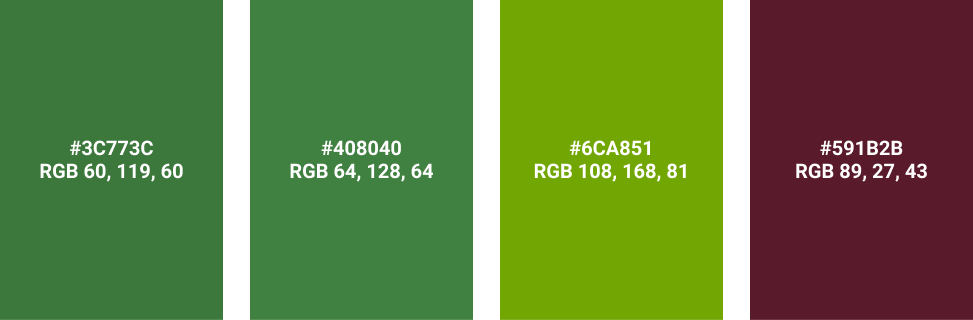
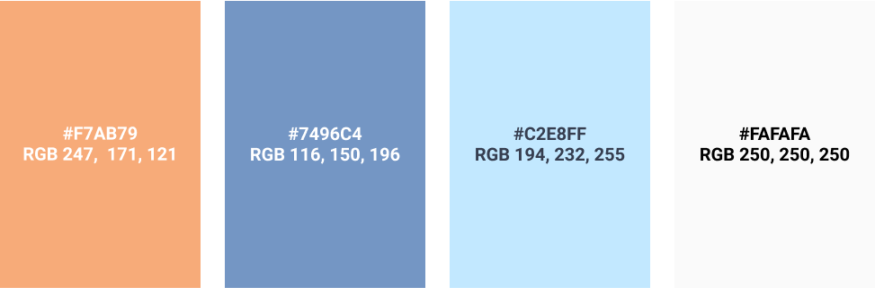
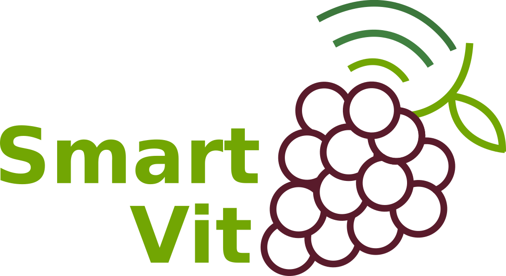
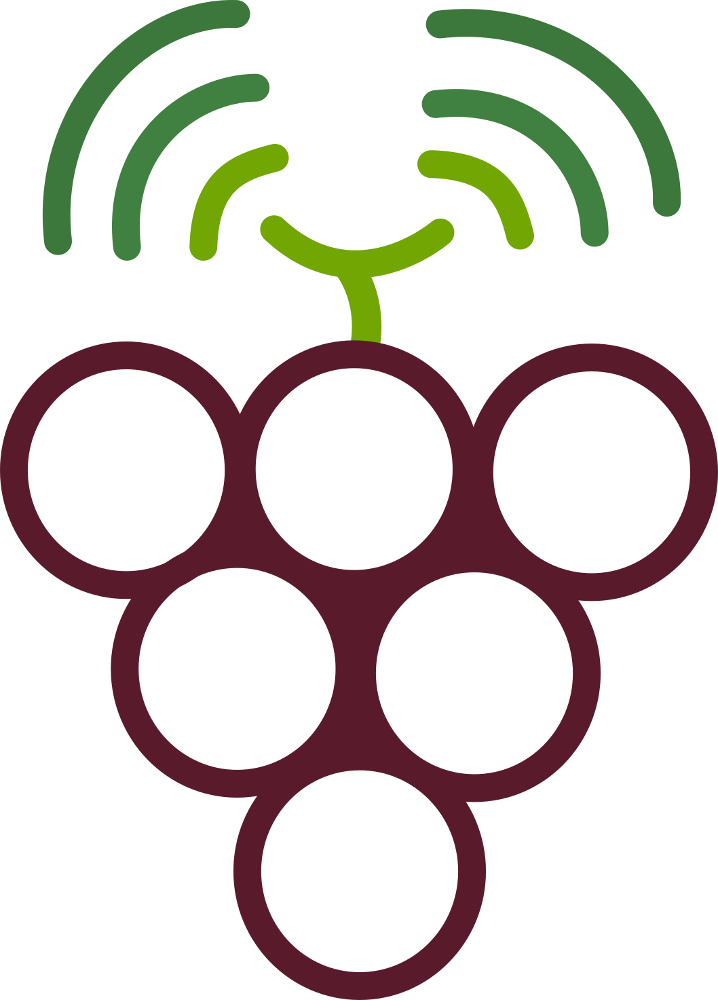
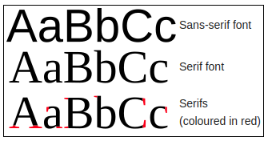

## Identidade Visual

- [1. Introdução](#_1-introdução)
- [2. Paleta de Cores](#_2-paleta-de-cores)
- [3. Logo e ícones](#_3-logo-e-ícones)
- [4. Tipografia](#_4-tipografia)
- [5. Referências](#_5-referências)
- [ Histórico de revisão](#_histórico-de-revisão)

## 1. Introdução

O Guia de identidade visual apresenta convenções para o design das telas da aplicação e para sua identidade visual a partir da definição de logomarca do produto, paleta de cores, tipografia e íconização utilizada na produção do front-end. Essas definições têm como objetivo ajudar a uniformizar a experiência do usuário durante o uso da aplicação.

## 2. Paleta de Cores

As cores que compõem a paleta de cores, foram definidas a partir da análise das cores da uva vermelha, a espécie de uva mais utilizada para a representação visual da fruta. Para a extração das cores foi utilizado o software Adobe Color, e o resultado obtido é mostrado a seguir:

A partir das cores obtidas, pensando na comodidade visual dos usuários, algumas cores foram alteradas para versões escuras das cores. Com este ajuste, a paleta primária da aplicação foi a seguinte:

Para a iconização da aplicação foi definida uma paleta secundária que seguia o padrão de cores relativo ao seu uso e representação. A seguir estão as cores secundárias utilizadas na aplicação.

## 3. Logo e ícones

 Para a logo e ícone foi definido o uso de um cacho de uvas de cor marsala, cujo objetivo consiste em remeter à coloração dos vinhos. Já as folhas em diferentes tons de verde, remetem à uma antena de símbolo Wi-fi referente ao sistema do projeto. As inspirações vieram da logo da empresa americana Apple e Fazendas Labrunier em Pernambuco, e do site WordDisk. Abaixo, seguem as imagens referes à logo e imagem para ser utilizada como ícone no projeto.

 

Imagem 1: Logo do Projeto SmartVit 

 Imagem 2: Ícone do Projeto SmartVit

## 4. Tipografia

 A escolha da tipografia na logo foi a sans-serif (sem serifa), esta fonte tem por uso comum a transmissão de ideias relacionadas a modernidade, simplicidade  e minimalismo, conceitos que condizem com o intuito da aplicação, que objetiva o minimalismo para melhorar a apresenção da modernidade ao contexto de viticultura. A seguir está a esquematização da fonte escolhida:

## 5. Referências

ADOBE, __Adobe Color CC__. Disponível em: <https://color.adobe.com/pt/create/image/>. Acesso em: 18 abr. 2020.

# Histórico de revisão

| O quê | Quem  | Quando |
| - | - | - |
| Primeira versão do documento | João Lucas | 17/04/2020 |
| Revisão entrega | Lucas Vitor | 24/04/2020 |
| Segunda versão | João Lucas | 22/05/2020 |
| Adição de histórico, organização e atualização de informações| Adrianne Alves da Silva | 25/08/2020 |
| Reorganização do documento, adição da análise de cores e atualização da tipografia | Lucas Vitor | 06/09/2020 |