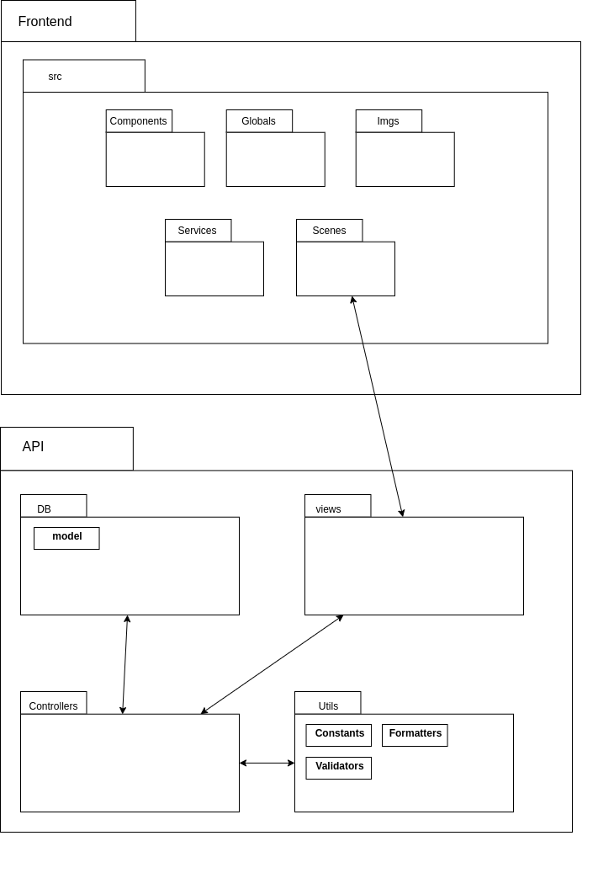

# Documento de Arquitetura

- [1. Introdução](#_1-introdução)
  * [1.1. Objetivos](#_11-objetivos)
  * [1.2. Escopo do documento](#_12-escopo-do-documento)
- [2. Representação da Arquitetura](#_2-representação-da-arquitetura)
- [3. Restrições e Metas Arquiteturais](#_3-restrições-e-metas-arquiteturais)
  * [3.1. Restrições](#_31-restrições)
  * [3.2. Metas Arquiteturais](#_32-metas-arquiteturais)
- [4. Visão de Casos de Uso](#_4-visão-de-casos-de-uso)
  * [4.1. Diagrama de Casos de Uso](#_41-Diagrama-de-Casos-de-Uso)
  * [4.2. Descrição dos Casos de Uso](#_42-Descrição-dos-Casos-de-Uso)
- [5. Visão Lógica](#_5-visão-lógica)
  * [5.1. Visão Geral: Pacotes e Camadas](#_51-visão-geral-pacotes-e-camadas)
  * [5.2. Visão Geral: Banco de Dados](#_52-visão-geral-banco-de-dados)
- [6. Visão do Processo](_6-visão-do-processo)
  * [6.1. Visão Geral: Sequências](#_61-visão-geral-sequencias)
  * [6.2. Visão Geral: Atividades](#_62-visão-geral-atividades)

- [7. Desempenho](#_7-desempenho)

- [8. Qualidade](#_8-qualidade)

## 1. Introdução

### 1.1. Objetivos

 
 Este documento tem como finalidade fornecer, de maneira detalhada, a arquitetura empregada na plataforma SmartVit, utilizando para isso representações arquiteturais, como a visão lógica e de casos de uso, com o objetivo de facilitar o entendimento dos processos e funcionamento de todo o sistema. Dessa forma, nesse documento está uma descrição técnica do modo como a plataforma SmartVit se estrutura, no que diz respeito à organização, comunicação e definição dos seus componentes e dado. Assim, espera-se que os interessados sejam capazes de visualizar as possíveis consequências, em termos de software, da arquitetura escolhida. 

###  1.2. Escopo

 A SmartVit consiste em uma plataforma desenvolvida para facilitar o processo de acompanhamento de vinícolas durante todo o ciclo de vida. Para isso, ela fornece os dados coletados pelo sistema eletrônico inteligente instalado na plantação, obtidos por meio dos sensores de solo e água, como informação utilizável pelo agrônomo responsável na tomada de decisões. Em termos técnicos, este documento abordará toda a lógica de construção da plataforma, abordando os casos de uso, diagramas de pacote, informações sobre desempenho, banco de dados e qualidade do software. 

## 2. Representação da Arquitetura

 A arquitetura adotada possui organização em microsserviços, isto se deve à robustez da aplicação a ser desenvolvida, com a utilização desta arquitetura é possível ter um software modularizado, manutenível e expansível, além disto, é possível ter responsabilidades distribuídas, o que o permite lidar melhor com a carga imposta sobre ele. 

 Como complemento da arquitetura de microsserviços, são utilizados BFF (Back For Front), uma decisão arquitetural que permite a contextualização do backend para os frontends existentes, sendo eles o usuário e o administrador. 

### 2.1. Diagrama de Relações

 Abaixo estão descritos os módulos que integram o sistema e suas relações. 

#### 2.1.1. Módulo Eletrônico

 Módulo físico responsável por captar dados como umidade, pH do solo, umidade e irrigação das vinícolas cadastradas. 

#### 2.1.2. Backend

 O backend é a unidade da arquitetura responsável por receber, processar e armazenar dados do módulo eletrônico. Neste ambiente serão realizados o gerenciamento das vinícolas e acionamento de sistemas (recebendo a entrada do usuário e repassando para o módulo eletrônico responsável). Além disso, o sistema contará com 9 diferentes microsserviços com responsabilidades distintas, explicitados na imagem anterior. 

#### 2.1.3. Frontend

 O frontend é a unidade responsável por criar a ponte entre o usuário e a API, enviando dados para requisições e recebendo dados para então formulá-los de forma inteligível ao usuário. 

#### 2.1.4. Banco de Dados

 Unidade responsável por armazenar os dados recebidos e processados pela API. 

### 2.2. Tecnologias

* HTML/CSS:	Utilizado no desenvolvimento Web de forma padrão e estruturado.
* Python: Linguagem de programação de alto nível, interpretada, de script, imperativa, orientada a objetos, funcional, de tipagem dinâmica e forte.
* Flask: Framework python que disponibiliza funcionalidades para desenvolvimento de APIs que seguem o estilo arquitetural REST.
* JavaScript: Linguagem de programação que permite a implementação de itens complexos em páginas web de forma dinâmica.
* FastAPI: É um framework python que permite requisições assíncronas, gerenciando um maior número de requisições com maior fluidez.
* ReactJS: Biblioteca JavaScript para construção de interfaces de usuários.
* MongoDB: Banco NOSQL orientado a documentos (document database) no formato JSON.

## 3. Restrições e Metas Arquiteturais

### 3.1. Restrições

- O sistema depende de conexão com internet;
- O sistema deve ser utilizado em ambiente web;
- Somente a API terá acesso direto ao banco de dados;

### 3.2. Metas Arquiteturais

- Deve garantir a privacidade dos dados inseridos em seu banco de dados;
- Deve conseguir responder às requisições em poucos segundos e ter alta disponibilidade;
- Deverá atender aos requisitos não funcionais, como disponibilidade, segurança, usabilidade, escalabilidade, garantir a manutenibilidade do sistema;
- Possuir desacoplamento e independência entre outros serviços.

## 4. Visão de Casos de Uso
Esta seção traz as situações de ações e uso do sistema, em termos de funcionalidades, descrevendo de modo sucinto como o mesmo será utilizado pelos atores ou usuários.

### 4.1. Diagrama de Casos de Uso
O diagrama de caso de uso descreve as funcionalidades propostas para um sistema, utilizando como princípio a atuação dos atores. Abaixo segue a primeira versão do diagrma elaborado.

### 4.2. Descrição dos Casos de Uso

#### UC 01 - Logar no sistema
| | |
| -- | -- |
| Descrição | Usuário realiza login no sistema. |
| Atores | Usuário |
| Pré-condições | Usuário deve acessar a página inicial do sistema em um navegador com internet |
| Pós-condições | Usuário deve ter acesso às funcionalidades que caibam ao seu perfil |
| Fluxo principal | 1. Usuário acessa página inicial da plataforma   2. Usuário digita login e senha   3. Usuário clica em "Entrar"|
| Fluxo de exceção | [UC 19] Caso a vinícola ainda não esteja cadastrada o usuário não possuirá login na plataforma. |

#### UC 02 - Visualizar notificações de criticidade
| | |
| -- | -- |
| Descrição | O usuário visualizará as notificações recebidas sobre quaisquer indicadores críticos relacionados à safra |
| Atores | usuário |
| Pré-condições | Usuário deve possuir perfil de agrônomo ou agricultor no sistema |
| Pós-condições | O usuário deve receber notificações sempre que a vinícola apresentar algum indicador fora do intervalo esperado, via email e através do próprio sistema |
| Fluxo principal | 1. Sistema detecta indicador fora do intervalo   2. Usuário recebe email sobre a criticidade de um indicador   3. Usuário entra no sistema   4.Usuário clica nas notificações |
| Fluxo de exceção | |

#### UC 03 - Visualizar indicadores da situação da safra
| | |
| -- | -- |
| Descrição | O usuário poderá visualizar um dashboard com os principais indicadores da safra |
| Atores | usuário |
| Pré-condições | O usuário deve estar logado no sistema |
| Pós-condições | O usuário deve visualizar todos os indicadores da safra |
| Fluxo principal | 1. Usuário realiza login no sistema   2. Sistema abre na dashboard   |
| Fluxo de exceção | |

#### UC 04 - Registrar pragas na vinícola
| | |
| -- | -- |
| Descrição | Usuário pode registrar pragas identificadas na sua vinícola para acompanhamento |
| Atores | usuário|
| Pré-condições | Usuário deve estar logado no sistema |
| Pós-condições | Na página de acompanhamento deve aparecer as pragas registradas |
| Fluxo principal | 1. Usuário faz login no sistema   2. Usuário acessa dashboard e clica em "registrar praga"   3. Preenche o formulário informando a praga   4.Registra plano de ação 5. Clica em 'enviar' |
| Fluxo de exceção | |

#### UC 05 - Acionar equipe do sistema
| | |
| -- | -- |
| Descrição | O usuário poderá acionar a equipe do sistema para eventuais problemas nos sistemas e/ou dados, enviando uma mensagem para a equipe |
| Atores | usuário |
| Pré-condições | Usuário deve estar logado no sistema como agrônomo ou agricultor |
| Pós-condições | O usuário deve conseguir enviar uma mensagem para o administrador a fim de informar irregularidade/problemas no sistema web|
| Fluxo principal | 1. O usuário deve entrar no sistema   2. Clicar no menu lateral correspondente à "suporte"   3. Preencher o formulário informando o tipo, título, mensagem e prioridade do problema e/ou solicitação   4. O usuário deve clicar "enviar"|
| Fluxo de exceção | |
#### UC 08 - Alertar sobre intemperies
| | |
| -- | -- |
| Descrição | O sistema irá alertar aos usuários sobre intempéries de acordo com a região em que a vinícola está cadastrada.|
| Atores | Sistema |
| Pré-condições | O contrato que associa a vinícola ao sistema deve estar ativo. |
| Pós-condições | O usuário deve receber por email e como notificação no sistema o aviso de intempéries |
| Fluxo principal | 1. O sistema recebe alerta de intempéries nas regiões das vinícolas cadastradas   2. O sistema envia a notificação para os usuários das vinícolas que estão sujeitas às intempéries|
| Fluxo de exceção | |

#### UC 09 - Notificar cancelamento
| | |
| -- | -- |
| Descrição | O sistema deve avisar ao usuário caso o contrato que abrange a vinícola que está monitorando seja cancelado por qualquer motivo |
| Atores | Sistema |
| Pré-condições | O usuário deve possuir cadastro no sistema |
| Pós-condições | O usuário deve receber o email enviado pelo sistema informando o cancelamento do contrato |
| Fluxo principal | 1. O contrato é cancelado   2. O sistema envia notificação para o agricultor e agrônomo |
| Fluxo de exceção | |

#### UC 10 - Bloquear acesso ao suporte do sistema eletrônico
| | |
| -- | -- |
| Descrição | O sistema deve bloquear o acesso às solicitações de suporte aos sistemas eletrônicos caso o contrato da vinícola tenha sido cancelado/expirado. |
| Atores | Sistema |
| Pré-condições | O contrato deve ter sido cancelado  |
| Pós-condições | O usuário não deve possuir acesso à funcionalidade de suporte aos sistemas eletrônicos |
| Fluxo principal | 1. Contrato é cancelado   2. O suporte ao sistema eletrônico fica indisponível para o usuário |
| Fluxo de exceção | |

#### UC 11 - Gerenciar sistemas eletrônicos da safra
| | |
| -- | -- |
| Descrição | O usuário deve ter acesso à todos os sistemas eletrônicos instalados na safra, incluindo os dados coletados e processados na plataforma. |
| Atores | Usuário |
| Pré-condições | O usuário deve estar logado na plataforma e possuir perfil de usuário |
| Pós-condições | O usuário deve ter acesso à todos os sistemas eletrônicos e dados processados dentro do sistema |
| Fluxo principal | 1. O usuário entra na plataforma   2. Clica em "Sistemas"   3. Vê a lista de sistemas instalados na vinícola   4. Entra em um sistema que deseja gerenciar   5. Visualiza os sensores instalados, dados coletados, entre outras informações |
| Fluxo de exceção | |

#### UC 12 - Acionar suporte dos sistemas eletrônicos
| | |
| -- | -- |
| Descrição | O usuário conseguirá entrar em contato com a equipe de suporte aos sistemas eletrônicos instalados |
| Atores | Usuário e Administrador |
| Pré-condições | O usuário deve estar logado |
| Pós-condições | O usuário deve poder acionar o suporte via mensagem na plataforma |
| Fluxo principal | 1. O agricultor entra na plataforma   2.Entra em "Sistemas instalados"   3. Clica em "acionar suporte"    4. Preenche um formulário informando qual o sistema e qual foi o problema identificado |
| Fluxo de exceção | |

#### UC 13 - Parar coleta de dados no servidor
| | |
| -- | -- |
| Descrição | Assim que um contrato for finalizado o sistema deve interromper a coleta de dados no servidor |
| Atores | Sistema |
| Pré-condições | O contrato deve ter sido cancelado ou ter finalizado |
| Pós-condições | O sistema deve apenas mostrar os dados até aquele momento, mas não coletar nenhum dado novo |
| Fluxo principal | 1. O contrato da vinícola é cancelado   2. O sistema interrompe a coleta de dados no servidor |
| Fluxo de exceção | |

#### UC 14 - Cancelar contrato
| | |
| -- | -- |
| Descrição | O administrador poderá cancelar um contrato, interrompendo as suas atividades |
| Atores | Administrador |
| Pré-condições | O usuário deve estar logado e possuir perfil de administrador |
| Pós-condições | 1. O sistema deve parar a coleta realizada para os sistemas referente àquele contrato   2. O sistema deve interromper o acesso do usuário ao acionamento do suporte para os sistemas físicos   3. O usuário se limitará apenas a visualizar os dados já processados até aquele momento   4. O usuário receberá uma notificação informando sobre o cancelamento. [UC 09] |
| Fluxo principal | 1. Administrador deve logar no sistema   2. Administrador deve selecionar "Contratos"   3. Deve clicar em "cancelar contrato"|
| Fluxo de exceção | |

#### UC 15 - Verificar tráfego de dados
| | |
| -- | -- |
| Descrição | O administrador verá o tráfego de dados dos sistemas presentes nas vinícolas |
| Atores | Administrador |
| Pré-condições | O usuário deve estar logado e possuir perfil de administrador |
| Pós-condições | O administrador deve ser capaz de visualizar pausas ou irregularidades através do tráfego de dados dos sensores |
| Fluxo principal | 1. O administrador loga no sistema   2. Ele clica na aba "Monitoramento"   3. Visualiza estado dos sensores |
| Fluxo de exceção | |

#### UC 16 - Notificar mau funcionamento de sistema eletrônico
| | |
| -- | -- |
| Descrição | Caso algum sistema apresente um grande intervalo de tempo sem enviar dados, o sistema deve notificar ao administrador sobre o problema no sistema eletrônico |
| Atores | Sistema |
| Pré-condições | Algum sensor deve deixar de enviar dados com regularidade |
| Pós-condições | Administrador recebe notificação e email informando qual o sistema eletrônico que possivelmente está com problemas |
| Fluxo principal | 1. O usuário deve entrar no sistema   2. Clicar no ícone correspondente à "sistema"   3. Abrirá uma página discriminando os sistemas instalados na vinícola 4. O usuário deve clicar em acionar suporte |
| Fluxo de exceção | |

#### UC 17 - Visualizar vinícolas
| | |
| -- | -- |
| Descrição | O administrador poderá visualizar as vinícolas cadastradas |
| Atores | Administrador |
| Pré-condições | O usuário deve estar logado e possuir perfil de administrador |
| Pós-condições | O usuário deve visualizar todas as vinícolas cadastradas |
| Fluxo principal | 1. Usuário entra no sistema   2. Usuário clica em "monitoramento" 3. Seleciona uma vinícola |
| Fluxo de exceção | |

#### UC 18 - Cadastrar contrato
| | |
| -- | -- |
| Descrição | O administrador irá realizar o cadastro de novos contratos na plataforma |
| Atores | Administrador |
| Pré-condições | O usuário deve estar logado e possuir perfil de administrador |
| Pós-condições | O contrato deve estar pronto para receber os dados da vinícola a ser vinculada |
| Fluxo principal | 1. O administrador entra no sistema   2. Clica em contrato 3. Clica em "novo contrato"   3. Preenche o formulário com os dados do novo contrato   4. O usuário é redirecionado para a página de contratos |
| Fluxo de exceção | |

#### UC 19 - Cadastrar vinícola
| | |
| -- | -- |
| Descrição | O administrador irá cadastrar as vinícolas associando-as a um contrato |
| Atores | Administrador |
| Pré-condições | 1. O usuário deve estar logado e ser administrador   2. O contrato deve existir e estar ativo |
| Pós-condições | 1. Devem ser criados os emails do agricultor e do agrônomo responsável, fornecendo-os acesso ao sistema   2. A vinícola deve aparecer na lista de vinícolas cadastradas   3. Os sistemas devem ser associados à vinícola    4. Os dados devem ser captados do servidor |
| Fluxo principal | 1. O administrador entra no sistema   2. Pesquisa pelo contrato que receberá a vinícola   3. Entra no contrato   4. Clica em "cadastrar vinícola"   5. Preenche o formulário   6. Clica em "cadastrar" |
| Fluxo de exceção | Se a vinícola já existir o usuário só poderá editar o cadastro |

#### UC 20 - Gerenciar contas
| | |
| -- | -- |
| Descrição | O administrador poderá cadastrar, ativar ou inativar contas para os contratos |
| Atores | Administrador |
| Pré-condições | 1. O usuário a ser cadastrado deve ser associado à vinícola e contrato correspondente |
| Pós-condições | 1. As contas dos usuários devem ser criadas, ativadas, inativadas ou atualizadas |
| Fluxo principal | 1. O administrador entra no sistema   2. Clica no menu lateral em "gerenciar usuários"   3. Administrador pode criar ou alterar os usuários |
| Fluxo de exceção |  |

#### UC 21 - Acompanhar solicitações
| | |
| -- | -- |
| Descrição | O administrador realizará o acompanhamento das solicitações recebidas de cadastro através da landing page |
| Atores | Administrador |
| Pré-condições | 1. O usuário deve ter perfil de administrador |
| Pós-condições | 1. O usuário deve ser capaz de visualizar, e dar check nas solicitações recebidas, marcando-as como atendidas, em execução ou canceladas |
| Fluxo principal | 1. O administrador entra no sistema   2. Clica no menu lateral em "solicitações"  |
| Fluxo de exceção |  |

## 5. Visão Lógica

### 5.1. Visão Geral: Pacotes e Camadas

 
 A seguir é expressa a estruturação básica representativa dos pacotes presentes no sistema SmartVit, por se tratar de uma arquitetura de microsserviços e possuir, por conseguinte, muitos componentes, foi escolhida uma estrutura básica para todos os serviços afim de manter a padronização do software, por este motivo foi escolhida a representação de uma forma simplificada do sistema, mas que representa a ideia por trás da arquitetura adotada.

A figura a seguir mostra a estrutura de pacotes do sistema:

### 5.2. Visão Geral: Banco de dados

A visão geral de banco de dados consiste na diagramação básica que define como será estruturado o banco de dados da aplicação. Nesse sentido, será apenas um banco de dados não relacional, cujos documentos estão explicitados abaixo.

## 6. Visão do Processo

### 6.1. Visão Geral: Sequências
O diagrama de sequência tem por objetivo exibir os ciclos de vida dentro da execução de uma parte específica do software e a maneira sequencial com a qual interagem os objetos, distribuídos no que chama-se em linhas de vida.

Diagrama de Sequência do Administrador no SmartVit:

Diagrama de Sequência do Agricultor no SmartVit:

Diagrama de Sequência do Agrônomo no SmartVit:

### 6.2. Visão Geral: Atividades

Diferente do diagrama de sequência, o diagrama de atividades tem por objetivo mostrar a parte comportamental do aplicativo, ou sejas, demostrar os fluxos entre os objetos, exibindo os processos de negócio e o fluxo de trabalho dos objetos.

Diagrama de Atividades do Administrador no SmartVit:

Diagrama de Atividades dos usuários Agrônomo e Agricultor no SmartVit:

## 7. Desempenho

 
 O desempenho do sistema está relacionado ao projeto todo. Por se tratar de um navegador PWA, a conexão com a internet e o aparelho eletrônico  são os fatores que pode causar os maiores problemas de seu desempenho, pois são os que demandam processamento mais abrangentes.

## 8. Qualidade

 O projeto terá uma interface gráfica intuitiva, portando as informações principais que provém do projeto para que seja eficaz aos usuários. Todas os dados que venham a ser recolhidos serão armazenados e uma tela que demostra essas informações será providenciada. 

 O código-fonte será bem estruturado, seguindo as normas definidas no documento de folha de estilo, respeitando a padronização e manutenibilidade, criando testes e respeitando as métricas deferidas no Plano de Qualidade.

# Histórico de revisão

| O quê | Quem  | Quando |
| - | - | - |
|  Versão 01 - visão de casos de uso e visão geral: Banco de Dados | Adrianne Alves | 22/05/2020 |
| Versão 01 - Introdução e Desempenho e Qualidade e Visão Geral: Pacotes e Camada | João Lucas | 22/05/2020 |
| Versão 01 - Representação da Arquitetura e Restrições e Metas Arquiteturais | Lucas Vitor | 22/05/2020 |
| Versão 01 - Reorganização do documento | Adrianne Alves da Silva | 23/08/2020 |
| Versão 02 - Inserção de diagrama lógico de banco de dados | Adrianne Alves da Silva | 09/09/2020 |
| Versão 02 - Atualização do diagrama de pacotes | Lucas Vitor | 10/09/2020 |
| Versão 02 - Atualização do diagrama de casos de uso | Adrianne Alves| 10/09/2020 |
| Versão 02 - Atualização do diagrama de arquitetura | Lucas Vitor| 11/09/2020 |
| Adição dos Diagramas de Atividades e Sequências | João Lucas e Luciano | 12/09/2020 |
| Adição do diagrama de atividades do administrador | João Lucas | 26/09/2020 |
| Atualização dos artefatos e descrições | Adrianne | 26/09/2020 |
