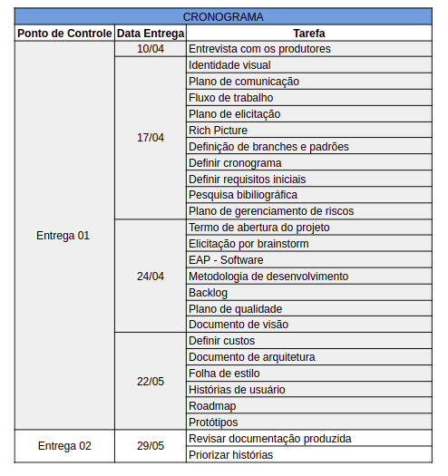

# Cronograma

- [1. Introdução](#_1-introdução)
- [2. Metodologia](#_2-metodologia)
- [3. Cronograma](#_3-cronograma)
- [ Histórico de revisão](#_histórico-de-revisão)

## 1. Introdução

Devido à pandemia corrente a equipe precisou relacionar um cronograma prévio para gerenciar as atividades a serem desenvolvidas, incluindo as tarefas que contribuem com a equipe em geral e as documentações estritas de software. É preciso salientar que não trabalhou-se utilizando estritamente a metodologia scrum nesse período, que compreendeu o desenvolvimento da documentação da equipe, mas também incorporamos a revisão em pares referente à metodologia XP. 

## 2. Metodologia

O cronograma foi definido conforme deliberação da equipe geral da disciplina, por meio do qual foram estabelecidos pontos de controle 1 e 2. Além disso, é preciso salientar que estas entregas foram fundamentadas nos requisitos do primeiro plano de ensino da disciplina, anterior à pandemia do COVID-19. Dessa forma, o compilado abaixo trata da relação histórica de como ocorreram as contribuições.

## 3. Cronograma

O cronograma abaixo é reflexo de como o time inicial trabalhou durante a pandemia. O time inicial compreende **Adrianne Alves**, **Lucas Vitor de Paula** e **João Lucas**.

  

Deve-se salientar que a priori, programou-se de acordo com os pontos de controles definidos pela equipe geral a serem desenvolvidos durante o período de suspensão das aulas. Entretanto, houve flexibilização nessa programação o que resultou no cronograma acima. Após essa fase, esperou-se o retorno das aulas onde foi feita a revisão e aprimoramento de toda essa documentação.

# Histórico de revisão

| O quê | Quem  | Quando |
| - | - | - |
|  Primeira versão | Adrianne Alves | 19/04/2020 |
| Revisão | Adrianne Alves | Semanal e pós pandemia (23/08/2020) |