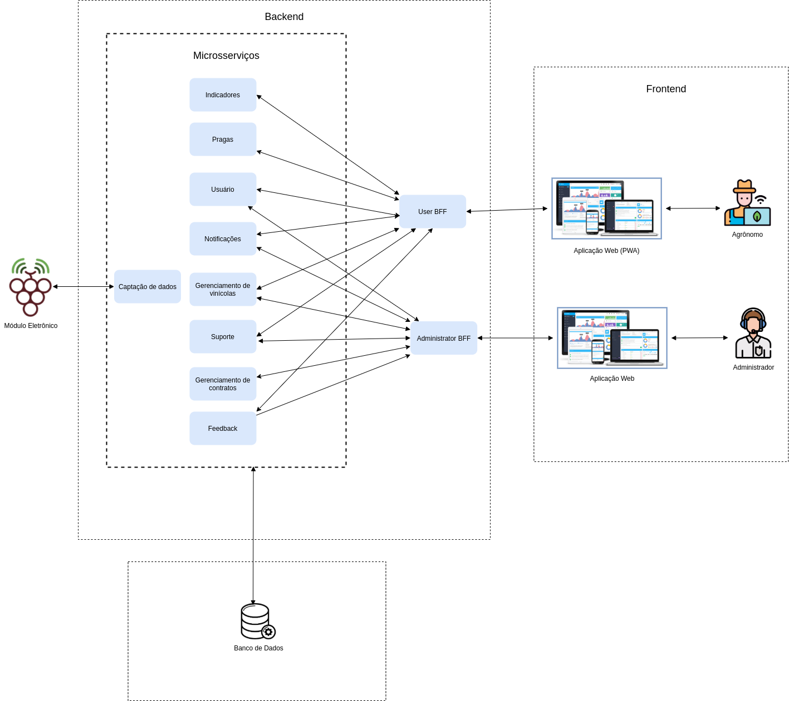

# Principais decisões da equipe

- [1. Introdução](#_1-introdução)
  * [1.1. Objetivos](#_11-objetivos)
- [2. Decisões Arquiteturais](#_2-decisões-arquiteturais)
- [3. Decisões Tecnolágicas](#_3-decisões-de-tecnolágicas)
- [4. Decisões Metodológicas](#_4-decisões-de-metodológicas)
- [5. Decisões de Outros Enfoques](#_5-decisões-de-outros-enfoques)
- [ Histórico de revisão](#_histórico-de-revisão)

## 1. Introdução

### 1.1. Objetivos

 
 Este documento tem como finalidade fornecer detalhes sobre as decisões tomadas pela equipe, afim de permitir a rastreabilidade e entendimento do processo lógico que levou às escolhas tomadas pela equipe incluindo arquitetura, tecnologias, metodologias e todas as informações relevantes 
 para o desenvolvimento da aplicação. 

## 2. Decisões Arquiteturais

 
 Tendo em mãos as definições iniciais de escopo e requisitos, foi definida uma arquitetura cliente-servidor, com a possibilidade de alteração para uma arquitetura de três camadas, com uma camada responsável pela captação e tratamento inicial dos dados, uma camada responsável pelo processamento e uma camada responsável pela apresentação dos dados. A diagramação inicial está apresentada abaixo:

 

 
 Com o amadurecimento da proposta, uma nova visão sobre a arquitetura do software foi criada, e apartir dela foi optado pela escolha de uma abordagem de microsserviços devido, dentre outros motivos, à robustez da aplicação, ncessidade de evolução e independência de alguns serviços. A diagramação está apresentada abaixo:

 

 
 Após a definição da arquitetura de microsserviços, foi percebida a possibilidade de criação de frontends distintos entre os usuários da aplicação. A partir desta nova abordagem, foi decidida a implementação da abordagem BFF (Back For Frontend), uma abordagem que permite contextualizar os microsserviços aos frontends distintos da aplicação. A diagramação está apresentada abaixo:

 

## 3. Decisões Tecnológicas

 
A partir da decisão arquitetural inicial, foram escolhidas as tecnologias que melhor se adequam às necessidades do software e da equipe. As tecnologias escolhidas foram: 

* HTML/CSS:	Utilizado no desenvolvimento Web de forma padrão e estruturado.
* Python: Linguagem de programação de alto nível, interpretada, de script, imperativa, orientada a objetos, funcional, de tipagem dinâmica e forte.
* Django REST Framework: Biblioteca para o Framework Django que disponibiliza funcionalidades para desenvolvimento de APIs que seguem o estilo arquitetural REST.
* JavaScript: Linguagem de programação que permite a implementação de itens complexos em páginas web de forma dinâmica.
* ReactJS: Biblioteca JavaScript para construção de interfaces de usuários.
* MongoDB: Banco NOSQL orientado a documentos (document database) no formato JSON.

 
Com a evolução da arquitetura de cliente-servidor para microsserviços, as escolhas tecnológicas foram evoluídas com o intuito de trazer melhor benefício à esta definição arquitetural. As tecnologias esolhidas foram: 

* HTML/CSS:	Utilizado no desenvolvimento Web de forma padrão e estruturado.
* Python: Linguagem de programação de alto nível, interpretada, de script, imperativa, orientada a objetos, funcional, de tipagem dinâmica e forte.
* Flask: Framework python que disponibiliza funcionalidades para desenvolvimento de APIs que seguem o estilo arquitetural REST.
* JavaScript: Linguagem de programação que permite a implementação de itens complexos em páginas web de forma dinâmica.
* ReactJS: Biblioteca JavaScript para construção de interfaces de usuários.
* MongoDB: Banco NOSQL orientado a documentos (document database) no formato JSON.

## 4. Decisões Metodológicas

Para a metodologia de trabalho foi escolhida uma metodologia híbrida entre Scrum e RUP. Esta metodologia conta com as fases do RUP com foco em documentação para a primeira fase de elaboração da solução, com os papéis inspirados no scrum, sendo estes product owner, scrum master, arquiteto, devops e desenvolvedores, e conta com os rituais de sprint, daily meeting, sprint review e sprint planning. bem como os artefatos de planejamento coposto por issues, milestones, épicos e priorização.

## 5. Decisões de Outros Enfoques

A ideia inicial para outros enfoques recaía sobre as análises feitas sobre os dados coletados, esta abordagem contava com a criação de bases de dados com os dados coletados para "alimentar" modelos de predição. Após amadurecimento da proposta, os outros enfoques focaram-se nas decisões arquiteturais da equipe, com a implementação de uma arquitetura de microsserviços e implementação de BFF.

Após reavaliação deste tópico, a equipe decidiu pela implementação da implementação arquitetural supracitada com a inclusão de lógica fuzzy para facilitar as análises de dados e BDD (Behavior Driven Development) como estratégia de testes da aplicação.

# Histórico de revisão

| O quê | Quem  | Quando |
| - | - | - |
| Primeira versão do documento | Lucas Vitor | 12/09/2020 |