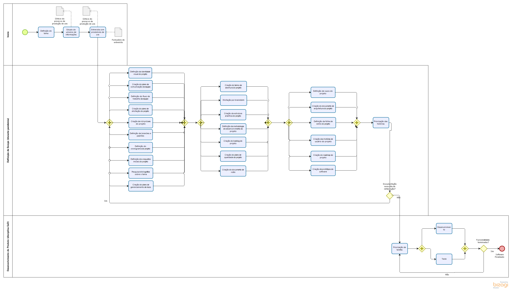

# <a name="Fluxo-trabalho">Fluxo de Trabalho</a>

## 1. <a name="1">Introdução</a>

 &emsp;&emsp; O documento de Fluxo de Trabalho explícita de como funcionará o desempenho dos membros de software da equipe em relação ao projeto SmartVit.

## 2. <a name="2">Fluxo de Trabalho da Equipe</a>

 &emsp;&emsp; A Gerência é um dos principais fatores de equipe, com isso, busca-se trabalhar separando as tarefas em sprints semanais e distribuindo entre papéis de Scrum Master, Product Owner e DevOps para os integrantes da equipe. A cada sprint, um membro do grupo assume um dos papéis, aumentando a gestão do conhecimento e diminuindo a sobrecarga da gerência para o restante da equipe.

### 2.1. <a name="2.1">Organização por Issues</a>

 &emsp;&emsp; A equipe busca gerenciar todas as suas atividades através das Issues do Github. Por essa aba da plataforma é possível que seja feita toda a organização visual das tarefas do projeto, tornando o gerenciamento do fluxo de trabalho da equipe mais dinâmico e centralizando as principais informações necessárias dentro do Github. Serão adicionadas novas issues em cada sprint até o fim do projeto e aquelas que não são finalizadas serão adicionadas para a sprint seguinte. As tarefas serão igualitárias entre os membros para que não seja sobrecarregada para ninguém e que respeite o backlog de produto e o cronograma.

### 2.2. <a name="2.2">Histórico de Commits</a>

 &emsp;&emsp; O histórico de commits não necessariamente funcionaria como medidor do fluxo de trabalho entre os membros. O projeto pode sofrer atrasos e modificações precisas em que podem afetar o histórico e prejudicando o progresso do commits do projeto.

### 2.3. <a name="2.3">Wiki</a>

* [SmartVit](https://pi2-viticultura.github.io/SmartVit/)
