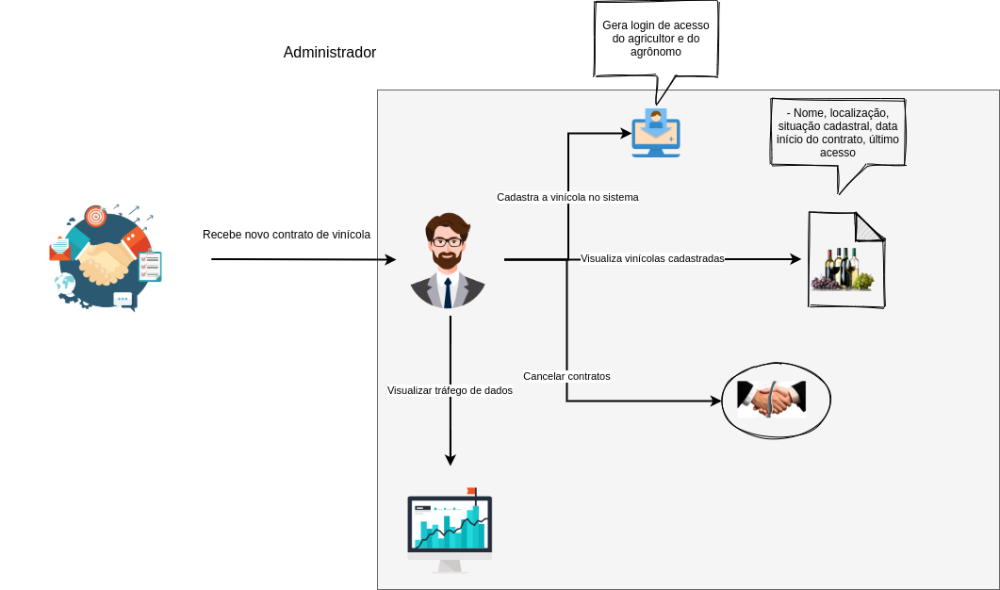

# Rich Picture

A técnica de uso do rich picture consiste no desenho consciente das ações dos atores relativos ao universo de informações ao qual compreende o domínio do produto a ser desenvolvido. Nesse sentido, espera-se expressar as regras de negócio como atuações no sistema. Abaixo seguem os rich pictures elaborados conforme as versões.

## Versão 01

* Visão do administrador

* Visão do agrônomo

* Visão do agricultor / dono da vinícola

# Requisitos elicitados

|  # | Descrição  | Ator |  Observação |
|---|---|---|---|
| 1 | Cadastro de vinícolas  | Administrador | Baseado nos dados dos contratos |
| 2 | Visualização de vinícolas cadastradas | Administrador | Visualização rápida das vinícolas e dados de nome, localização, último acesso e data de início do contrato |
| 3 | Filtro de vinícolas | Administrador | Por localização, nome, último de acesso e data de início do contrato |
| 4 | Cancelar monitoramento via aplicativo | Administrador | |
| 5 | Visualizar tráfego de dados dos sensores de cada vinícola | Administrador | Possibilitar identificação de sensores com algum problema de funcionamento |
| 6 | Visualizar indicadores gerais | Agrônomo, Agricultor | Ver indicadores de água, solo, temperatura |
| 7 | Visualizar notificações de criticidade | Agrônomo |
| 8 | Notificar usuários de criticidade nos dados coletados | Sistema ||
| 9 | Gerenciar sistemas instalados na vinícola | Agrônomo | ver informações específicas de cada sistema instalado |
| 10 | Acionar sistemas de irrigação/ incidência solar | Agrônomo | Em caso de emergência, o agrônomo deve poder acionar o sistema de irrigação |
| 11 | Notificar usuário de intemperies na região da vinícola | Sistema | |
| 12 | Acionar equipe do sistema | Agrônomo, agricultor | Ser possível entrar em contato com a equipe e solicitar reparos | 
| 13 | Avaliar safra | Agrônomo | Após a colheita, o agrônomo pode registrar as características da uva obtida e visualizar as propriedades de sabor e variações que influenciarão na qualidade do vinho |
| 14 | Analisar qualidade da safra dado um tipo de uva | Agrônomo | O agronômo poderá obter uma análise preditiva que indique a qualidade da safra de determinado tipo de uva naquele local * |
| 15 | Alertar sistema quanto a pragas | Agrônomo |  Será possível avisar o sistema quanto a pragas * |
| 16 | Visualizar alertas de clima/intemperies | Agricultor | |
