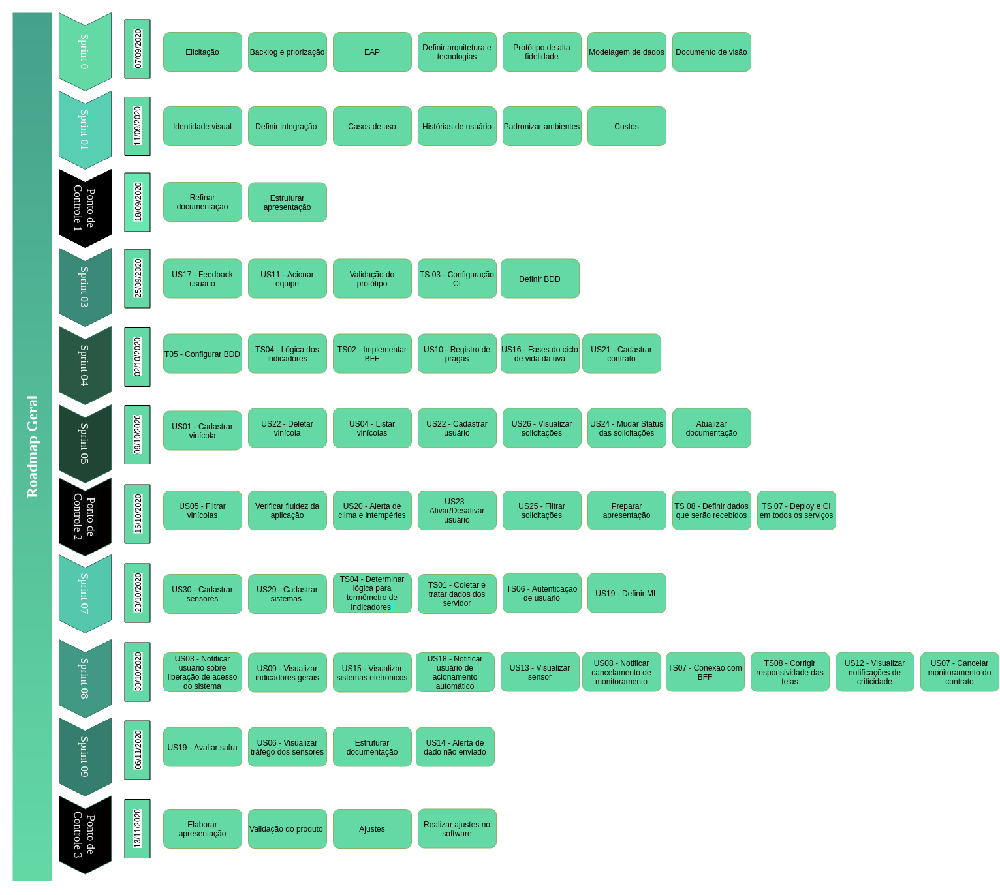

## Roadmap

- [1. Introdução](#_1-introdução)
- [2. Roadmap estruturado ](#_2-roadmap-estruturado)
- [ Histórico de revisão](#_histórico-de-revisão)

### 1. Introdução 

O roadmap consiste em um documento de organização de entregas e tarefas que envolvem desde à concepção das definições iniciais à construção do produto. Nele, define-se através de marcos as parcelas de entregas que serão realizadas. No caso do projeto SmartVit será considerado o intervalo de 1 semana entre cada marco, referente à definição das nossas sprints.

* A priori, não foram estabelecidos as datas de cada marco, pois, devido ao corona vírus a dinâmica de entregas está se comportando de maneira diferente. Espera-se que assim que consolidada a definição estrutural do projeto de software, possamos programar as entregas descritas abaixo.

### 2. Roadmap estruturado 

Após reunião com nova equipe, após redistribuição dos grupos, o roadmap foi revisado e foram definidas datas para ocorrência de cada uma das sprints. 

# Histórico de revisão

| O quê | Quem  | Quando |
| - | - | - |
|  Primeira versão do documento | Adrianne Alves | 22/05/2020 |
| Revisão entrega| Lucas Vitor | 27/04/2020 |
| Reorganização do documento | Adrianne Alves da Silva | 23/08/2020
